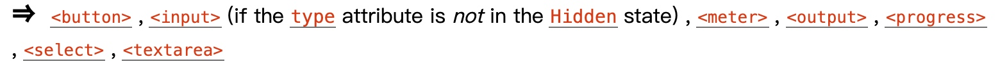
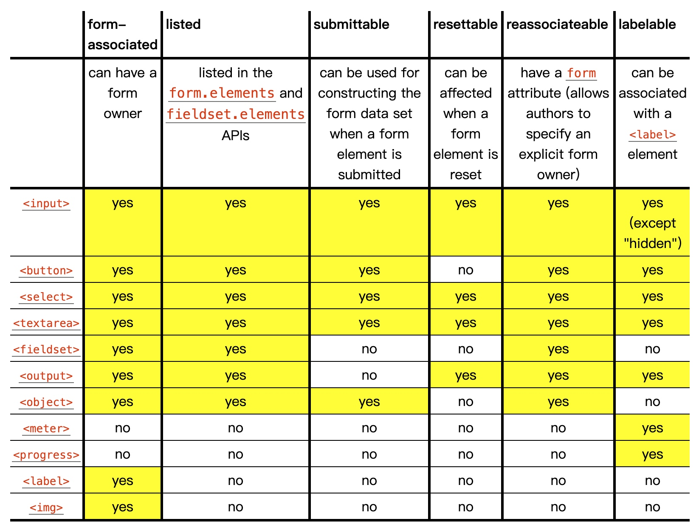

## 4.10 表单
### 4.10.1 介绍
本节是非规范性的。

表单是具有表单控件（例如文本字段，按钮，复选框，范围控件或颜色选择器）的 Web 页面的组件。用户可以与这种形式进行交互，从而提供可以随后发送到服务器的数据以进行进一步处理（例如，返回搜索或计算的结果）。尽管可以使用API，但在许多情况下不需要客户端脚本，但脚本可以增强用户体验或出于向服务器提交数据以外的目的使用表单。

编写表单包含几个步骤，这些步骤可以按任意顺序执行：编写用户界面，实现服务端处理以及配置用户界面与服务器通信。

#### 4.10.1.1 编写用户界面
本节是非规范性的。

出于本简介的目的，我们将创建一个披萨饼预定表单。

任何表单都以 form 元素开头，在其中放置控件。大多数控件由 input 元素表示，默认情况下提供一个单行文本字段。为了给控件加标签，使用了 label 元素。标签文本和控件本身位于 label 元素内部。表单中的每个区域通常使用 div 元素表示。综上所述，这是人们可能会询问客户名称的方法：

```html
<form>
  <div><label>Customer name: <input></label></div>
</form>
```

为了让用户选择披萨的大小，我们可以使用一组单选按钮。单选按钮也使用 input 元素，这次使用 type 属性和属性值为 radio。为了使单选按钮作为一个组工作，可以使用 name 属性为它们指定一个通用名称。要将一批控件（例如单选按钮）组合在一起，可以使用 fieldset 元素。这样一组控件的标题由 fieldset 中的第一个元素给出，该元素必须是 legend 元素。

```html
<form>
  <div><label>Customer name: <input></label></div>
  <fieldset>
  <legend> Pizza Size </legend>
  <div><label> <input type=radio name=size> Small </label></div>
  <div><label> <input type=radio name=size> Medium </label></div>
  <div><label> <input type=radio name=size> Large </label></div>
  </fieldset>
</form>
```

> 注意
>
> 与上一步的改变将高亮显示。
>

要选择配料，我们可以使用复选框。这些将 input 元素与带有属性值为 checkbox 的 type 属性一起使用：

```html
<form>
  <div><label>Customer name: <input></label></div>
  <fieldset>
  <legend> Pizza Size </legend>
  <div><label> <input type=radio name=size> Small </label></div>
  <div><label> <input type=radio name=size> Medium </label></div>
  <div><label> <input type=radio name=size> Large </label></div>
  </fieldset>
  <fieldset>
  <legend> Pizza Toppings </legend>
  <div><label> <input type=checkbox> Bacon </label></div>
  <div><label> <input type=checkbox> Extra Cheese </label></div>
  <div><label> <input type=checkbox> Onion </label></div>
  <div><label> <input type=checkbox> Mushroom </label></div>
  </fieldset>
</form>
```

为此编写的表单的披萨店总是出错，因此需要一种与客户联系的方式。为此，我们可以将表单控件专门用于电话号码（type 属性值设置为 tel 的 input 元素）和电子邮件地址（type 属性值设置为 email 的 input 元素）：

```html
<form>
  <div><label>Customer name: <input></label></div>
  <div><label>Telephone: <input type=tel></label></div>
  <div><label>E-mail address: <input type=email></label></div>
  <fieldset>
  <legend> Pizza Size </legend>
  <div><label> <input type=radio name=size> Small </label></div>
  <div><label> <input type=radio name=size> Medium </label></div>
  <div><label> <input type=radio name=size> Large </label></div>
  </fieldset>
  <fieldset>
  <legend> Pizza Toppings </legend>
  <div><label> <input type=checkbox> Bacon </label></div>
  <div><label> <input type=checkbox> Extra Cheese </label></div>
  <div><label> <input type=checkbox> Onion </label></div>
  <div><label> <input type=checkbox> Mushroom </label></div>
  </fieldset>
</form>
```

我们可以使用 type 属性值设置为 time 的 input 元素来询问交付时间。这些表单控件中的许多控件都有属性来精确控制可以指定的值。在这种情况下，特别感兴趣的三个属性是 min，max 和 step。这些可以设置最小时间，最大时间以及允许值之间的间隔（以秒为单位）。该披萨店仅在上午 11 点至晚上 9 点之间投放，并且承诺的增量不会超过15分钟，我们可以将其标记为：

```html
<form>
  <div><label>Customer name: <input></label></div>
  <div><label>Telephone: <input type=tel></label></div>
  <div><label>E-mail address: <input type=email></label></div>
  <fieldset>
  <legend> Pizza Size </legend>
  <div><label> <input type=radio name=size> Small </label></div>
  <div><label> <input type=radio name=size> Medium </label></div>
  <div><label> <input type=radio name=size> Large </label></div>
  </fieldset>
  <fieldset>
  <legend> Pizza Toppings </legend>
  <div><label> <input type=checkbox> Bacon </label></div>
  <div><label> <input type=checkbox> Extra Cheese </label></div>
  <div><label> <input type=checkbox> Onion </label></div>
  <div><label> <input type=checkbox> Mushroom </label></div>
  </fieldset>
  <div><label>Preferred delivery time: <input type=time min="11:00" max="21:00" step="900"></label></div>
</form>
```

textarea 元素可用于提供自由格式的文本字段。在这种情况下，我们将使用它来作为客户提供交货说明的空间：

```html
<form>
  <div><label>Customer name: <input></label></div>
  <div><label>Telephone: <input type=tel></label></div>
  <div><label>E-mail address: <input type=email></label></div>
  <fieldset>
  <legend> Pizza Size </legend>
  <div><label> <input type=radio name=size> Small </label></div>
  <div><label> <input type=radio name=size> Medium </label></div>
  <div><label> <input type=radio name=size> Large </label></div>
  </fieldset>
  <fieldset>
  <legend> Pizza Toppings </legend>
  <div><label> <input type=checkbox> Bacon </label></div>
  <div><label> <input type=checkbox> Extra Cheese </label></div>
  <div><label> <input type=checkbox> Onion </label></div>
  <div><label> <input type=checkbox> Mushroom </label></div>
  </fieldset>
  <div><label>Preferred delivery time: <input type=time min="11:00" max="21:00" step="900"></label></div>
  <div><label>Delivery instructions: <textarea></textarea></label></div>
</form>
```

最后，为了使表单可提交，我们使用 button 元素：

```html
<form>
  <div><label>Customer name: <input></label></div>
  <div><label>Telephone: <input type=tel></label></div>
  <div><label>E-mail address: <input type=email></label></div>
  <fieldset>
  <legend> Pizza Size </legend>
  <div><label> <input type=radio name=size> Small </label></div>
  <div><label> <input type=radio name=size> Medium </label></div>
  <div><label> <input type=radio name=size> Large </label></div>
  </fieldset>
  <fieldset>
  <legend> Pizza Toppings </legend>
  <div><label> <input type=checkbox> Bacon </label></div>
  <div><label> <input type=checkbox> Extra Cheese </label></div>
  <div><label> <input type=checkbox> Onion </label></div>
  <div><label> <input type=checkbox> Mushroom </label></div>
  </fieldset>
  <div><label>Preferred delivery time: <input type=time min="11:00" max="21:00" step="900"></label></div>
  <div><label>Delivery instructions: <textarea></textarea></label></div>
  <div><button>Submit order</button></div>
</form>
```

#### 4.10.1.2 实现服务端处理
本节是非规范性的。

编写服务器端处理器的确切详细信息超出了本规范的范围。出于介绍的目的，我们假设将 `https://pizza.example.com/order.cgi` 上的脚本配置为使用 `application/x-www-form-urlencoded` 格式接受提交，并希望发送以下参数在 HTTP POST body 中：

- custname：客户姓名
- custtel：客户手机号码
- custemail：客户邮箱
- size：披萨大小，有 small, medium, 或 large
- topping：选择调料，有 培根，奶酪，洋葱，蘑菇
- delivery：要求的交货时间
- comments：交货说明

#### 4.10.1.3 配置用户界面与服务端通信
本节是非规范性的。

表单提交以多种方式向服务器公开，最常见的方式是 HTTP GET 或 POST 请求。要指定使用的方法，在 form 元素上指定 method 属性。不过，这并未指定表单数据的编码方式；要指定的话，请使用 enctype 属性。您还必须使用 action 属性指定将处理提交的数据的服务的 URL。

然后，对于要提交的每个表单控件，必须提供一个名称，该名称将用于引用提交中的数据。我们已经为单选按钮组指定了名称；相同的属性（name）也指定提交名称 通过使用 value 属性为单选按钮赋予不同的值，可以在提交中将它们区别开来。

多个控件可以具有相同的名称；例如，在这里，我们为所有复选框赋予相同的名称，服务器通过查看使用该名称提交的值来区分选中了哪个复选框-像单选按钮一样，它们也被赋予带有 value 属性的唯一值。

给定上一节中的设置，所有这些变为：

```html
<form method="post"
      enctype="application/x-www-form-urlencoded"
      action="https://pizza.example.com/order.cgi">
  <p><label>Customer name: <input name="custname"></label></p>
  <p><label>Telephone: <input type=tel name="custtel"></label></p>
  <p><label>E-mail address: <input type=email name="custemail"></label></p>
  <fieldset>
  <legend> Pizza Size </legend>
  <p><label> <input type=radio name=size value="small"> Small </label></p>
  <p><label> <input type=radio name=size value="medium"> Medium </label></p>
  <p><label> <input type=radio name=size value="large"> Large </label></p>
  </fieldset>
  <fieldset>
  <legend> Pizza Toppings </legend>
  <p><label> <input type=checkbox name="topping" value="bacon"> Bacon </label></p>
  <p><label> <input type=checkbox name="topping" value="cheese"> Extra Cheese </label></p>
  <p><label> <input type=checkbox name="topping" value="onion"> Onion </label></p>
  <p><label> <input type=checkbox name="topping" value="mushroom"> Mushroom </label></p>
  </fieldset>
  <p><label>Preferred delivery time: <input type=time min="11:00" max="21:00" step="900" name="delivery"></label></p>
  <p><label>Delivery instructions: <textarea name="comments"></textarea></label></p>
  <p><button>Submit order</button></p>
</form>
```

> 注意
>
> 某些属性引用其值而其他属性不引用的方式没有特别的意义。HTML 语法允许使用各种同等有效的方式来指定属性，如§8HTML语法中所述。
>

例如，如果客户输入 “Denise Lawrence” 作为他们的名字，“555-321-8642” 作为他们的电话号码，没有指定电子邮件地址，要求 medium 的比萨饼，则选择 “额外的奶酪和蘑菇” 的配料，写入 7pm 的交付时间，并将交货说明文本字段留空，用户代理会将以下内容提交到在线 Web 服务：

```
custname=Denise+Lawrence&custtel=555-321-8642&custemail=&size=medium&topping=cheese&topping=mushroom&delivery=19%3A00&comments=
```

#### 4.10.1.4 表单校验
本节是非规范性的。

表单可以通过以下方式注解：用户代理将在提交表单之前检查用户的输入。服务器仍然必须验证输入是否有效（因为恶意用户可以轻松地绕过表单验证），但是通过让服务器成为用户输入的唯一检查者，它可以使用户避免等待。

最简单的注解是 required 属性，可以在 input 元素上指定该属性，直到指示在给定值之前不提交表单。通过将此属性添加到客户名称，披萨大小和交货时间的字段，我们允许用户代理在用户提交表单时通知用户，而无需填写这些字段：

```html
<form method="post"
      enctype="application/x-www-form-urlencoded"
      action="https://pizza.example.com/order.cgi">
  <p><label>Customer name: <input name="custname" required></label></p>
  <p><label>Telephone: <input type=tel name="custtel"></label></p>
  <p><label>E-mail address: <input type=email name="custemail"></label></p>
  <fieldset>
  <legend> Pizza Size </legend>
  <p><label> <input type=radio name=size required value="small"> Small </label></p>
  <p><label> <input type=radio name=size required value="medium"> Medium </label></p>
  <p><label> <input type=radio name=size required value="large"> Large </label></p>
  </fieldset>
  <fieldset>
  <legend> Pizza Toppings </legend>
  <p><label> <input type=checkbox name="topping" value="bacon"> Bacon </label></p>
  <p><label> <input type=checkbox name="topping" value="cheese"> Extra Cheese </label></p>
  <p><label> <input type=checkbox name="topping" value="onion"> Onion </label></p>
  <p><label> <input type=checkbox name="topping" value="mushroom"> Mushroom </label></p>
  </fieldset>
  <p><label>Preferred delivery time: <input type=time min="11:00" max="21:00" step="900" name="delivery" required></label></p>
  <p><label>Delivery instructions: <textarea name="comments"></textarea></label></p>
  <p><button>Submit order</button></p>
</form>
```

也可以使用 maxlength 属性来限制输入的长度。通过将其添加到 textarea 元素中，我们可以将用户限制为 1000 个字符，从而防止他们写大量无用的文字而不写重点：

```html
<form method="post"
      enctype="application/x-www-form-urlencoded"
      action="https://pizza.example.com/order.cgi">
  <p><label>Customer name: <input name="custname" required></label></p>
  <p><label>Telephone: <input type=tel name="custtel"></label></p>
  <p><label>E-mail address: <input type=email name="custemail"></label></p>
  <fieldset>
  <legend> Pizza Size </legend>
  <p><label> <input type=radio name=size required value="small"> Small </label></p>
  <p><label> <input type=radio name=size required value="medium"> Medium </label></p>
  <p><label> <input type=radio name=size required value="large"> Large </label></p>
  </fieldset>
  <fieldset>
  <legend> Pizza Toppings </legend>
  <p><label> <input type=checkbox name="topping" value="bacon"> Bacon </label></p>
  <p><label> <input type=checkbox name="topping" value="cheese"> Extra Cheese </label></p>
  <p><label> <input type=checkbox name="topping" value="onion"> Onion </label></p>
  <p><label> <input type=checkbox name="topping" value="mushroom"> Mushroom </label></p>
  </fieldset>
  <p><label>Preferred delivery time: <input type=time min="11:00" max="21:00" step="900" name="delivery" required></label></p>
  <p><label>Delivery instructions: <textarea name="comments" maxlength=1000></textarea></label></p>
  <p><button>Submit order</button></p>
</form>
```

> 注意
>
> 提交表单后，将在每个校验的表单控件上触发校验事件，然后在 form 元素本身上触发。这对于显示表单问题的简介很有用，因为通常浏览器本身一次只会报告一个问题。
>

#### 4.10.1.5 表单控件的自动填写
本节是非规范性的。

一些浏览器试图通过自动填写表单控件来帮助用户，而不是让用户每次都重新输入其信息。例如，可以使用用户的电话号码自动填写询问用户电话号码的字段。

为了帮助用户代理解决此问题，可以使用 autocomplete 属性来描述该字段的用途。在这种形式的情况下，我们可以用这种方式对三个字段进行有用的注解：关于将披萨运送给谁的信息。添加此信息如下所示：

```html
<form method="post"
      enctype="application/x-www-form-urlencoded"
      action="https://pizza.example.com/order.cgi">
  <p><label>Customer name: <input name="custname" required autocomplete="shipping name"></label></p>
  <p><label>Telephone: <input type=tel name="custtel" autocomplete="shipping tel"></label></p>
  <p><label>E-mail address: <input type=email name="custemail" autocomplete="shipping email"></label></p>
  <fieldset>
  <legend> Pizza Size </legend>
  <p><label> <input type=radio name=size required value="small"> Small </label></p>
  <p><label> <input type=radio name=size required value="medium"> Medium </label></p>
  <p><label> <input type=radio name=size required value="large"> Large </label></p>
  </fieldset>
  <fieldset>
  <legend> Pizza Toppings </legend>
  <p><label> <input type=checkbox name="topping" value="bacon"> Bacon </label></p>
  <p><label> <input type=checkbox name="topping" value="cheese"> Extra Cheese </label></p>
  <p><label> <input type=checkbox name="topping" value="onion"> Onion </label></p>
  <p><label> <input type=checkbox name="topping" value="mushroom"> Mushroom </label></p>
  </fieldset>
  <p><label>Preferred delivery time: <input type=time min="11:00" max="21:00" step="900" name="delivery" required></label></p>
  <p><label>Delivery instructions: <textarea name="comments" maxlength=1000></textarea></label></p>
  <p><button>Submit order</button></p>
</form>
```


#### 4.10.1.6 字段类型，自动填充字段名称和输入模态之间的区别
本节是非规范性的。

type 和 autocomplete 属性似乎令人迷惑。例如，在这三种情况下，字符串“电子邮件”是一个有效的值。本节试图说明这三个属性之间的区别，并提供建议如何使用它们。

input 元素上的 type 属性决定用户代理将使用哪种控件。在此属性的不同值之间进行选择 与 选择是否使用 input 元素，textarea 元素，select 元素等是相同的选择。

相比之下，autocomplete 属性描述了用户将实际输入的值。在此属性的不同值之间进行选择 与 选择元素的标签相同。

首先，考虑电话号码。如果页面要求用户提供电话号码，则要使用的正确表格控件是 `<input type="tel">`。但是，要使用哪个 autocomplete 值取决于页面要求的电话号码，他们希望使用国际格式的电话号码还是仅使用本地格式的电话号码，等等。

例如，构成电子商务网站上结帐流程一部分的页面，该页面中的客户购买要运送给朋友的礼物，客户可能需要买方的电话号码（在付款问题的情况下）和朋友的电话号码（如果出现发货问题）。如果该站点需要国际电话号码（带有国家/地区代码前缀），则可能看起来像这样：

```html
<div><label>Your phone number: <input type=tel name=custtel autocomplete="billing tel"></label>
<div><label>Recipient’s phone number: <input type=tel name=shiptel autocomplete="shipping tel"></label>
<p>Please enter complete phone numbers including the country code prefix, as in "+1 555 123 4567".
```

但是，如果该网站仅支持英国的客户和收件人，则它可能看起来像这样（请注意使用 tel-national 而非 tel）：

```html
<div><label>Your phone number: <input type=tel name=custtel autocomplete="billing tel-national"></label>
<div><label>Recipient’s phone number: <input type=tel name=shiptel autocomplete="shipping tel-national"></label>
<p>Please enter complete UK phone numbers, as in "(01632) 960 123".
```

现在，考虑一个人的首选语言。正确的 autocomplete 值是语言。但是，可能有许多不同的表单控件用于此目的：自由文本字段（`<input type = text>`），下拉列表（`<select>`），单选按钮（`<input type="radio">`） 等等。这仅取决于所需的接口类型。

#### 4.10.1.7 日期、时间、数字格式
本节是非规范性的。

在此披萨饼交付示例中，时间以 “HH:MM” 格式指定：小时的两位数字（24小时制）和时间的两位数字。（也可以指定第二个，尽管在此示例中没有必要。）

但是，在某些地区，当呈现给用户时，时间通常以不同的方式表达。例如，在美国，使用带有 am/pm 指示的 12 小时制仍然很普遍，例如 “2pm”。在法国，通常使用 24 小时制，并使用 “h” 字符将小时与分钟分开，例如 “14h00”。

日期方面也存在类似的问题，更复杂的是，甚至各个组成部分的顺序也不总是一致的-例如，在塞浦路斯共和国，2003年2月的第一天通常写为 “1/2/03”，而在日本，同一日期通常将其写为 “2003年02月01日”，即使是数字，其区域设置也有所不同，例如，标点符号用作小数点分隔符和千位分隔符。

因此，重要的是要区分 HTML 和表单提交中使用的时间，日期和数字格式，这些格式始终是本规范中定义的格式（并基于针对计算机可读的日期和时间格式的公认的 ISO 8601 标准），从浏览器呈现给用户并被浏览器接受为用户输入的时间，日期和数字格式。

“连线” 格式，即 HTML 标记和表单提交中的格式，无论用户的语言环境如何，都应是计算机可读且一致的格式。例如，日期始终以 “YYYY-MM-DD” 格式编写，如 “2003-02-01” 一样。预计用户永远不会看到这种格式。

然后，页面以 “连线” 格式给出的时间，日期或数字会转换为用户的首选演示文稿（基于用户的偏好或页面本身的语言环境），然后再显示给用户。同样，在用户使用其首选格式输入时间，日期或数字后，用户代理将其转换回 “连线” 格式，然后再将其放入 DOM 或提交。

这允许页面和服务器上的脚本以一致的方式处理时间，日期和数字，而无需支持数十种不同的格式，同时仍支持用户的需求。

> 注意
>
> 另请参阅有关表单控件本地化的实施说明。
>

> 警告
>
> 在某些地方，例如 “标准夏令时”，当时钟向后移动时，同一时间可能在同一天发生两次。type 为 datetime-local 或 time 的 input 元素无法区分两个相同的时间实例。如果这种差异很重要，则应用程序应允许用户指定它们是指重复时间的出现，例如通过在“冬季时间”和“夏季时间”之间进行选择。
>

### 4.10.2 分类
主要是出于历史原因，本节中的元素除了流内容，短语内容和可交互内容之类的常见元素外，还分为几个重叠（但略有不同）的类别。

许多元素是与表单相关的元素，这意味着它们可以拥有一个表单所有者。


与表单相关的元素分为几个子类别：
1. 列出来的元素（原：Listed elements）：
    表示在 form.elements 和 fieldset.elements API中列出的元素。
    
    
2. 可提交的元素（原：Submittable elements）
    表示在提交 form 元素时可用于构造表单数据集的元素。
    
    
    根据其属性，某些可提交元素可以是按钮。下文中定义了元素何时为按钮。一些按钮用于专门提交按钮。
3. 可重置的元素（原：Resettable elements）
    表示重置 form 元素时可能受影响的元素。
    
    
4. 可重新关联的元素（原：Reassociateable elements）
    表示具有表单内容属性和匹配的表单 IDL 属性的元素，这些元素允许作者指定显式表单所有者。
    
    

并非全部与表单相关联的某些元素被归类为可标记元素。这些是可以与 label 元素关联的元素。



下列表格是非规范性的，总结了以上表单元素的类别：


### 4.10.3 form 元素
**元素定义**
1. **类别：**
    1. 流内容
    2. 可感知内容
2. **可以使用此元素的上下文：**
    1. 流内容里的任何地方
3. **内容模型：**
    1. 流内容，但后代不能有 form 元素
4. **标签省略：**
    1. 这两个标签都不可省略
5. **内容属性：**
    1. 全局属性
    2. accept-charset - 用于 §4.10.21 表单提交的字符编码
    3. action - 用于 §4.10.21 表单提交的 URL
    4. autocomplete - 表单中控件自动填充功能的默认设置
    5. enctype - 用于 §4.10.21 表单提交的表单数据集编码类型
    6. method - 用于 §4.10.21 表单提交的 HTTP 方法
    7. name - 在 document.forms API 中使用的表单名称
    8. novalidate - 用于 §4.10.21 表单提交的绕过表单控件的验证
    9. target - §4.10.21 表单提交的浏览上下文
6. **允许的 `ARIA role attribute values`：**
    1. dd>form (默认 - 不设置), search or presentation.
7. **允许的 `Allowed ARIA state and property attributes`：**
    1. 全局 aria-* 属性
    2. 适用于默认角色的任何 aria-* 属性
8. **DOM 接口：**

    ```ts
    [OverrideBuiltins]
    interface HTMLFormElement : HTMLElement {
      attribute DOMString acceptCharset;
      attribute DOMString action;
      attribute DOMString autocomplete;
      attribute DOMString enctype;
      attribute DOMString encoding;
      attribute DOMString method;
      attribute DOMString name;
      attribute boolean noValidate;
      attribute DOMString target;
    
      [SameObject] readonly attribute HTMLFormControlsCollection elements;
      readonly attribute unsigned long length;
      getter Element (unsigned long index);
      getter (RadioNodeList or Element) (DOMString name);
    
      void submit();
      void reset();
      boolean checkValidity();
      boolean reportValidity();
    };
    ```

form 元素表示与表单相关的元素的集合，其中一些可以表示可提交给服务器进行处理的可编辑值。

accept-charset 内容属性提供用于提交的字符编码。如果指定，则该值必须是有序的一组唯一的，以空格分隔的，不区分大小写的标记，并且不区分大小写，并且每个标记都必须是不区分大小写的 ASCII 匹配项，以匹配 ASCII 兼容编码的标签之一。[ENCODING]

TODO

### 4.10.4 label 元素
TODO

### 4.10.5 input 元素
1. **类别：**
    1. 流内容
    2. 短语内容
    3. 如果 `type` 属性没有 `hidden` 状态：可交互内容
    4. 如果 `type` 属性没有 `hidden` 状态：listed, submittable, resettable, 和可重关联的元素
    5. 如果 `type` 属性没有 `hidden` 状态：可感知内容
2. **可以使用此元素的上下文：**
    1. 流内容里的任何地方
3. **内容模型：**
    1. “空”
4. **标签省略：**
    1. 这两个标签都不可省略
5. **内容属性：**
    1. 全局属性
    2. accept-charset - 用于 §4.10.21 表单提交的字符编码
    3. action - 用于 §4.10.21 表单提交的 URL
    4. autocomplete - 表单中控件自动填充功能的默认设置
    5. enctype - 用于 §4.10.21 表单提交的表单数据集编码类型
    6. method - 用于 §4.10.21 表单提交的 HTTP 方法
    7. name - 在 document.forms API 中使用的表单名称
    8. novalidate - 用于 §4.10.21 表单提交的绕过表单控件的验证
    9. target - §4.10.21 表单提交的浏览上下文
6. **允许的 `ARIA role attribute values`：**
    1. dd>form (默认 - 不设置), search or presentation.
7. **允许的 `Allowed ARIA state and property attributes`：**
    1. 全局 aria-* 属性
    2. 适用于默认角色的任何 aria-* 属性
8. **DOM 接口：**

    ```ts
    interface HTMLInputElement : HTMLElement {
      attribute DOMString accept;
      attribute DOMString alt;
      attribute DOMString autocomplete;
      attribute boolean autofocus;
      attribute boolean defaultChecked;
      attribute boolean checked;
      attribute DOMString dirName;
      attribute boolean disabled;
      readonly attribute HTMLFormElement? form;
      readonly attribute FileList? files;
      attribute DOMString formAction;
      attribute DOMString formEnctype;
      attribute DOMString formMethod;
      attribute boolean formNoValidate;
      attribute DOMString formTarget;
      attribute unsigned long height;
      attribute boolean indeterminate;
      readonly attribute HTMLElement? list;
      attribute DOMString max;
      attribute long maxLength;
      attribute DOMString min;
      attribute long minLength;
      attribute boolean multiple;
      attribute DOMString name;
      attribute DOMString pattern;
      attribute DOMString placeholder;
      attribute boolean readOnly;
      attribute boolean _required;
      attribute unsigned long size;
      attribute DOMString src;
      attribute DOMString step;
      attribute DOMString type;
      attribute DOMString defaultValue;
      [TreatNullAs=EmptyString] attribute DOMString value;
      attribute object? valueAsDate;
      attribute unrestricted double valueAsNumber;
      attribute unsigned long width;
    
      void stepUp(optional long n = 1);
      void stepDown(optional long n = 1);
    
      readonly attribute boolean willValidate;
      readonly attribute ValidityState validity;
      readonly attribute DOMString validationMessage;
      boolean checkValidity();
      boolean reportValidity();
      void setCustomValidity(DOMString error);
    
      [SameObject] readonly attribute NodeList labels;
    
      void select();
      attribute unsigned long? selectionStart;
      attribute unsigned long? selectionEnd;
      attribute DOMString? selectionDirection;
      void setRangeText(DOMString replacement);
      void setRangeText(DOMString replacement, unsigned long start, unsigned long end, optional SelectionMode selectionMode = "preserve");
      void setSelectionRange(unsigned long start, unsigned long end, optional DOMString direction);
    };
    ```
    
    input 元素表示一个类型化的数据字段，通常带有一个表单控件以允许用户编辑数据。

#### 4.10.5.1 type 属性的状态
##### 4.10.5.1.1 hidden 状态(type=hidden)
###### 4.10.5.1.2 text 状态(type=text)和 search 状态(type=search)
##### 4.10.5.1.3 telephone 状态(type=tel)
##### 4.10.5.1.4 URL 状态(type=url)
##### 4.10.5.1.5 E-mail 状态(type=email)
##### 4.10.5.1.6 password 状态(type=password)
##### 4.10.5.1.7 date 状态(type=date)
##### 4.10.5.1.8 month 状态(type=month)
##### 4.10.5.1.9 week 状态(type=week)
##### 4.10.5.1.10 time 状态(type=time)
##### 4.10.5.1.11 当地日期 和 time 状态(type=datetime-local)
##### 4.10.5.1.12 number 状态(type=number)
##### 4.10.5.1.13 range 状态(type=range)
##### 4.10.5.1.14 color 状态(type=color)
##### 4.10.5.1.15 checkbox 状态(type=checkbox)
##### 4.10.5.1.16 radio 按钮状态(type=radio)
##### 4.10.5.1.17 file 上传状态(type=file)
##### 4.10.5.1.18 submit 按钮状态(type=submit)
##### 4.10.5.1.19 image 状态(type=image)
##### 4.10.5.1.20 reset 状态(type=reset)
##### 4.10.5.1.21 button 状态(type=button)

#### 4.10.5.2 关于表单控件本地化的实现说明

#### 4.10.5.3 公共 input 元素属性
##### 4.10.5.3.1 maxlength 和 minlength 属性
##### 4.10.5.3.2 size 属性
##### 4.10.5.3.3 readonly 属性
##### 4.10.5.3.4 required 属性
##### 4.10.5.3.5 multiple 属性
##### 4.10.5.3.6 pattern 属性
##### 4.10.5.3.7 min 和 max 属性
##### 4.10.5.3.8 step 属性
##### 4.10.5.3.9 list 属性
##### 4.10.5.3.10 placeholder 属性

#### 4.10.5.4 公共 input 元素 API
#### 4.10.5.5 公共 事件行为

### 4.10.6 button 元素
### 4.10.7 select 元素
### 4.10.8 datalist 元素
### 4.10.9 optgroup 元素
### 4.10.10 option 元素
### 4.10.11 textarea 元素
### 4.10.12 output 元素
### 4.10.13 progress 元素
### 4.10.14 meter 元素
### 4.10.15 fieldset 元素
### 4.10.16 legend 元素

### 4.10.17 表单控件基础设施
#### 4.10.17.1 表单控件值
#### 4.10.17.2 可变性
#### 4.10.17.3 控件和表单之间的联系

### 4.10.18 表单控件公共属性
#### 4.10.18.1 命名表单控件：name 属性
#### 4.10.18.2 提交元素方向：dirname 属性
#### 4.10.18.3 限制用户输入长度：maxlength 属性
#### 4.10.18.4 设置最小输入长度要求：minlength 属性
#### 4.10.18.5 启用和禁用表单控件：disabled 属性
#### 4.10.18.6 表单提交
##### 4.10.18.6.1 自动聚焦表单控件：autofocus 属性
#### 4.10.18.7 自动填充
##### 4.10.18.7.1 自动填充表单控件：autocomplete 属性
##### 4.10.18.7.2 处理模型

### 4.10.19 用于文本选择的 API
### 4.10.20 约束
#### 4.10.20.1 定义
#### 4.10.20.2 约束校验
#### 4.10.20.3 约束校验的 API
#### 4.10.20.4 安全性

### 4.10.21 表单提交
#### 4.10.21.1 介绍
#### 4.10.21.2 Implicit submission
#### 4.10.21.3 表单提交算法
#### 4.10.21.4 构建表单数据集
#### 4.10.21.5 选择表单提交编码
#### 4.10.21.6 URL 编码的表单数据
#### 4.10.21.7 multipart 表单数据
#### 4.10.21.8 纯文本 表单数据

### 4.10.22 重置表单