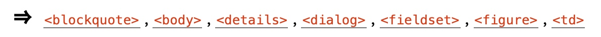

## 4.3 节
### 4.3.1 body 元素
**元素定义**
1. **类别：**
    1. 节的根
2. **可以使用此元素的上下文：**
    1. 作为 html 元素中的第二个元素
3. **内容模型：** 
    1. 流内容
4. **标签省略：**
    1. 如果元素为空，或者如果 body 元素内的第一个不是空格或注释，则可以省略 body 元素的开始标签，除非 body 元素内的第一个是 meta，link，script，style ，或 template 元素
    2. 如果未在 body 元素后紧跟注释，则可以忽略 body 元素的结束标签
5. **内容属性：**
    1. 全局属性
    2. onafterprint
    3. onbeforeprint
    4. onbeforeunload
    5. onhashchange
    6. onlanguagechange
    7. onmessage
    8. onoffline
    9. ononline
    10. onpagehide
    11. onpageshow
    12. onpopstate
    13. onrejectionhandled
    14. onstorage
    15. onunhandledrejection
    16. onunload
6. **允许的 `ARIA role attribute values`：**
    1. document role (默认 - 不设置)
7. **允许的 `Allowed ARIA state and property attributes`：**
    1. 全局 aria-* 属性
    2. 适用于默认角色的任何 aria-* 属性
8. **DOM 接口：**
    
    ```ts
    interface HTMLBodyElement : HTMLElement {
    };
    HTMLBodyElement implements WindowEventHandlers;
    ```
    
body 元素表示文档的内容。

在文档中，只有一个 body 元素。 document.body IDL 属性可以使脚本轻松访问文档的body 元素。

> 注意
某些 DOM 操作（例如，drag 和 drop 模型的一部分）是根据 “body 元素” 定义的。就术语的定义而言，这是指在 DOM 中的特定元素，而不是任何 body 元素。

body 元素暴露了多个 Window 对象的事件处理程序作为事件处理程序的内容属性。它还镜像了它们的事件处理程序 IDL 属性。

Window 对象的 onblur，onerror，onfocus，onload，onresize 和 onscroll 事件处理程序暴露给了 body 元素，通常由 HTML 元素支持的相同名称替换通用事件处理程序。

> 示例 1
因此，例如，派发在文档的 body 元素的子元素上的冒泡错误事件将首先触发该元素的 onerror 事件处理程序的内容属性，然后触发 根 html 元素的 onerror 事件处理程序的内容属性，然后才触发 body 元素上的 onerror 事件处理程序的内容属性。这是因为事件冒泡从 target，到 body，到 html，到文档，最后到 Window，并且 body 上的事件处理程序正在监视的是 Window 而不是 body。但是，使用 addEventListener() 添加给 body 元素，则事件冒泡时在 body 上运行，而不是到达 Window 对象时运行。

> 示例 2
此页面更新指示以显示用户是否在线：
```html
<!DOCTYPE HTML>
<html>
  <head>
    <title>Online or offline?</title>
    <script>
      function update(online) {
        document.getElementById('status').textContent =
        online ? 'Online' : 'Offline';
      }
    </script>
  </head>
  <body ononline="update(true)"
    onoffline="update(false)"
    onload="update(navigator.onLine)">
    <p>You are: <span id="status">(Unknown)</span></p>
  </body>
</html>
```

### 4.3.2 article 元素 
**元素定义**
1. **类别：**
    1. 流内容
    2. 节内容
    3. 可感知内容
2. **可以使用此元素的上下文：**
    1. 流内容里的任何地方
3. **内容模型：** 
    1. 流内容，但后代里没有 main 元素
4. **标签省略：**
    1. 这两个标签都不可省略
5. **内容属性：**
    1. 全局属性
6. **允许的 `ARIA role attribute values`：**
    1. article (默认 - 不设置), application, document feed, main 或 region.
7. **允许的 `Allowed ARIA state and property attributes`：**
    1. 全局 aria-* 属性
    2. 适用于默认角色的任何 aria-* 属性
8. **DOM 接口：**
    使用 HTMLElement 接口
    
article 元素代表文档，页面，应用程序或站点中的完整或独立的组成。这可能是杂志，报纸，技术或学术文章，文章或报告，博客或其他社交媒体帖子。

一般规则是，仅当元素的内容需要在文档的大纲中明确列出时，article 元素才适用。通常通过将标题（h1-h6 元素）作为 article 元素的子元素来识别每篇文章。

辅助技术可以将 article 的语义传达给用户。该信息可以向用户提供有关内容类型的提示。 例如，当用户导航到 article 元素时，屏幕阅读器可以声明元素的角色，在这种情况下，该元素与元素名称 “article” 匹配。用户代理还可以提供导航到 article 元素的方法。

当嵌套 article 元素时，内部 article 元素表示原则上与外部 article 内容相关的文章。例如，站点上的博客条目可以由嵌套在该博客条目的 article 元素内的 article 元素中的其他博客条目的摘要组成。

> 示例 3
以下是使用 article 元素标记的博客文章摘录的示例：
```html
<article>
 <header>
  <h2><a href="https://herbert.io">Short note on wearing shorts</a></h2>
   <p>Posted on Wednesday, 10 February 2016 by Patrick Lauke.
   <a href="https://herbert.io/short-note/#comments">6 comments</a></p>
 </header>
 <p>A fellow traveller posed an interesting question: Why do you wear shorts rather than
 longs? The person was wearing culottes as the time, so I considered the question equivocal in nature,
 but I attempted to provide an honest answer despite the dubiousness of the questioner’s dress.</p>
 <p>The short answer is that I enjoy wearing shorts, the long answer is...</p>
 <p><a href="https://herbert.io/short-note/">Continue reading: Short note on
 wearing shorts</a></p>
</article>
```

> 注意
schema.org 词汇表可以使用 CreativeWork-Article 子类型来提供有关文章类型的更详细的信息，还可以提供其他信息，例如文章的发布日期。

> 示例 4
此示例显示了使用 article 元素的博客帖子，其中带有一些 schema.org 批注：
```html
<article vocab="http://schema.org/" typeof="Article">
  <header>
    <h2  property="name">The Very First Rule of Life</h2>
    <p property="datePublished"><time datetime="2016-02-28">3 days ago</time></p>
  </header>
  <div property="articleBody">
  <p>If there’s a microphone anywhere near you, assume it’s hot and
  sending whatever you’re saying to the world. Seriously.</p>
  <p>...</p>
  </div>
  <footer>
    <a href="?comments=1">Show comments...</a>
  </footer>
</article>
```
这是同一篇博客文章，但显示了一些评论：
```html
<article>
  <header>
    <h2>The Very First Rule of Life</h2>
    <p><time datetime="2009-10-09">3 days ago</time></p>
  </header>
  <p>If there’s a microphone anywhere near you, assume it’s hot and
  sending whatever you’re saying to the world. Seriously.</p>
  <p>...</p>
  <section>
    <h3>Comments</h3>
    <ol>
      <li id="c1">
        <p>Posted by: <span>
        <span>George Washington</span>
        </span></p>
        <p><time datetime="2009-10-10">15 minutes ago</time></p>
        <p>Yeah! Especially when talking about your lobbyist friends!</p>
      <li id="c2">
        <p>Posted by: <span>
        <span>George Hammond</span>
        </span></p>
        <p><time datetime="2009-10-10">5 minutes ago</time></p>
        <p>Hey, you have the same first name as me.</p>
      </li>
    </ol>
  </section>
</article>
```
请注意，使用排序列表 ol 来组织评论。还要注意，注释是文章的小节，使用 section 元素标识。

### 4.3.3 section 元素
**元素定义**
1. **类别：**
    1. 流内容
    2. 节内容
    3. 可感知内容
2. **可以使用此元素的上下文：**
    1. 流内容里的任何地方
3. **内容模型：** 
    1. 流内容
4. **标签省略：**
    1. 这两个标签都不可省略
5. **内容属性：**
    1. 全局属性
6. **允许的 `ARIA role attribute values`：**
    1. region (默认 - 不设置), alert, alertdialog, application, contentinfo , dialog, document, feed, log, main, marquee, presentation, region, search, status 或 tabpanel.
7. **允许的 `Allowed ARIA state and property attributes`：**
    1. 全局 aria-* 属性
    2. 适用于默认角色的任何 aria-* 属性
8. **DOM 接口：**
    使用 HTMLElement 接口
    
section 元素代表文档或应用程序的通用部分（原：section）。在这种情况下，一段（原：section）是内容的主题分组。通常应通过将标题（h1-h6 元素）作为 section 元素的子元素来标识每个部分。

> 示例 5
部分（原：sections）的示例包括章节，选项卡式对话框中的各个选项卡式页面或论文的编号部分。网站的首页可以分为几个部分，以进行介绍，新闻和联系信息。

> 注意
当内容完整或自成一体时，鼓励作者使用 article 元素而不是 section 元素。

> 注意
section 元素不是通用容器元素。如果仅出于样式目的或为了方便编写脚本而需要元素，则鼓励作者使用 div 元素。通常的规则是，section 元素仅在文档的大纲中明确列出该元素的内容时才适用。

当元素具有显式标签（原：label）时，辅助技术可以将部分的语义传达给用户。该信息可以向用户提供有关内容类型的提示。例如，当用户导航到 section 元素时，可以通过屏幕阅读器软件声明该元素的角色（在这种情况下为 “region”）。用户代理还可以提供导航到 section 元素的方法。

> 示例 6
在下面的示例中，我们看到有关苹果的文章（较大的网页的一部分），其中包含两个简短的部分（sections）。
    **注意**
    该 section 具有一个 aria-label 属性，提供内容的简要说明。辅助技术可以将 region 角色以及 aria-label 值传达给用户。
```html
<article>
  <header>
    <h2>Apples</h2>
    <p>Tasty, delicious fruit!</p>
  </header>
  <p>The apple is the pomaceous fruit of the apple tree.</p>
  <section aria-label="Red apples.">
    <h3>Red Delicious</h3>
    <p>These bright red apples are the most common found in many
    supermarkets.</p>
  </section>
  <section aria-label="Green apples.">
    <h3>Granny Smith</h3>
    <p>These juicy, green apples make a great filling for
    apple pies.</p>
  </section>
</article>
```

> 示例 7
这是一个包含两个部分（原：sections）的毕业计划，一个部分（原：section）用于列出要毕业的人员，另一部分（原：section）用于说明仪式。（此示例中的标记是一种罕见的风格，有时用于最小化元素间空白的数量。）
```html
<!DOCTYPE Html>
<html
  ><head
    ><title
      >Graduation Ceremony Summer 2022</title
    ></head
  ><body
    ><h1
      >Graduation</h1
    ><section
      ><h2
        >Ceremony</h2
      ><p
        >Opening Procession</p
      ><p
        >Speech by Validactorian</p
      ><p
        >Speech by Class President</p
      ><p
        >Presentation of Diplomas</p
      ><p
        >Closing Speech by Headmaster</p
    ></section
    ><section
      ><h2
        >Graduates</h2
      ><ul
        ><li
          >Molly Carpenter</li
        ><li
          >Anastasia Luccio</li
        ><li
          >Ebenezar McCoy</li
        ><li
          >Karrin Murphy</li
        ><li
          >Thomas Raith</li
        ><li
          >Susan Rodriguez</li
      ></ul
    ></section
  ></body
 ></html>
```

> 示例 8
    在此示例中，书籍作者将某些部分标记为章节，另一些标记为附录，并使用 CSS 对这两个部分的标题进行了不同的样式设置。整本书包装在一个 article 元素中，作为包含其他书籍的更大文档的一部分。    
```html
<style>
  section { border: double medium; margin: 2em; }
  section.chapter h3 { font: 2em Roboto, Helvetica Neue, sans-serif; }
  section.appendix h3 { font: small-caps 2em Roboto, Helvetica Neue, sans-serif; }
</style>
<article class="book">
  <header>
    <h2>My Book</h2>
    <p>A sample with not much content</p>
    <p><small>Published by Dummy Publicorp Ltd.</small></p>
  </header>
  <section class="chapter">
    <h3>My First Chapter</h3>
    <p>This is the first of my chapters. It doesn’t say much.</p>
    <p>But it has two paragraphs!</p>
  </section>
  <section class="chapter">
    <h3>It Continues: The Second Chapter</h3>
    <p>Bla dee bla, dee bla dee bla. Boom.</p>
  </section>
  <section class="chapter">
    <h3>Chapter Three: A Further Example</h3>
    <p>It’s not like a battle between brightness and earthtones would go
    unnoticed.</p>
    <p>But it might ruin my story.</p>
  </section>
  <section class="appendix">
    <h3>Appendix A: Overview of Examples</h3>
    <p>These are demonstrations.</p>
  </section>
  <section class="appendix">
    <h3>Appendix B: Some Closing Remarks</h3>
    <p>Hopefully this long example shows that you <em>can</em> style
    sections, so long as they are used to indicate actual sections.</p>
  </section>
</article>
```

### 4.3.4 nav 元素
**元素定义**
1. **类别：**
    1. 流内容
    2. 节内容
    3. 可感知内容
2. **可以使用此元素的上下文：**
    1. 流内容里的任何地方
3. **内容模型：** 
    1. 流内容，但后代里没有 main 元素
4. **标签省略：**
    1. 这两个标签都不可省略
5. **内容属性：**
    1. 全局属性
6. **允许的 `ARIA role attribute values`：**
    1. navigation (默认 - 不设置)
7. **允许的 `Allowed ARIA state and property attributes`：**
    1. 全局 aria-* 属性
    2. 适用于默认角色的任何 aria-* 属性
8. **DOM 接口：**
    使用 HTMLElement 接口

nav 元素表示链接到其他页面或页面中各个部分的页面部分：具有导航链接的部分。

辅助技术可以将导航的语义传达给用户。该信息可以向用户提供有关内容类型的提示。例如，当用户导航到 nav 元素时，屏幕阅读器可以声明该元素的角色（在本例中为 “navigation”）。 用户代理还可以提供导航至 nav 元素的方法。

> 注意
如果 nav 元素的内容表示项目列表，请使用 list 标记来帮助理解和导航。

> 注意
并非页面上的所有链接组都需要位于 nav 元素中-该元素主要用于包含主要导航块的部分。特别是，页脚通常有简短的指向站点各个页面的链接列表，例如服务条款，主页和版权页面。在这种情况下，仅 footer 元素就足够了。尽管在这种情况下可以使用 nav 元素，但通常是不必要的。

> 注意
User agents (such as screen readers) that are targeted at users who can benefit from navigation information being omitted in the initial rendering, or who can benefit from navigation information being immediately available, can use this element as a way to determine what content on the page to initially skip or provide on request (or both).


> 示例 9
在以下示例中，有两个 nav 元素，一个用于站点的主要导航，另一个用于页面本身的辅助导航。
```html
<body>
  <h1>The Wiki Center Of Exampland</h1>
  <nav>
    <ul>
      <li><a href="/">Home</a></li>
      <li><a href="/events">Current Events</a></li>
      ...more...
    </ul>
  </nav>
  <article>
    <header>
      <h2>Demos in Exampland</h2>
      <p>Written by A. N. Other.</p>
    </header>
    <nav>
      <ul>
        <li><a href="#public">Public demonstrations</a></li>
        <li><a href="#destroy">Demolitions</a></li>
        ...more...
      </ul>
    </nav>
    <div>
      <section id="public">
        <h2>Public demonstrations</h2>
        <p>...more...</p>
      </section>
      <section id="destroy">
        <h2>Demolitions</h2>
        <p>...more...</p>
      </section>
      ...more...
    </div>
    <footer>
      <p><a href="?edit">Edit</a> | <a href="?delete">Delete</a> | <a href="?Rename">Rename</a></p>
    </footer>
  </article>
  <footer>
    <p><small>© copyright 1998 Exampland Emperor</small></p>
  </footer>
</body>
```

> 示例 10
在下面的示例中，页面上有几个存在链接的地方，但是这些地方中只有一个被视为导航部分。
```html
<body typeof="schema:Blog">
  <header>
    <h1>Wake up sheeple!</h1>
    <p><a href="news.html">News</a> -
    <a href="blog.html">Blog</a> -
    <a href="forums.html">Forums</a></p>
    <p>Last Modified: <span property="schema:dateModified">2009-04-01</span></p>
    <nav>
      <h2>Navigation</h2>
      <ul>
        <li><a href="articles.html">Index of all articles</a></li>
        <li><a href="today.html">Things sheeple need to wake up for today</a></li>
        <li><a href="successes.html">Sheeple we have managed to wake</a></li>
      </ul>
    </nav>
  </header>
  <main>
    <article property="schema:blogPosts" typeof="schema:BlogPosting">
      <header>
        <h2 property="schema:headline">My Day at the Beach</h2>
      </header>
      <section property="schema:articleBody">
        <p>Today I went to the beach and had a lot of fun.</p>
        ...more content...
      </section>
      <footer>
        <p>Posted <time property="schema:datePublished" datetime="2009-10-10">Thursday</time>.</p>
      </footer>
    </article>
    ...more blog posts...
  </main>
  <footer>
    <p>Copyright ©
      <span property="schema:copyrightYear">2010</span>
      <span property="schema:copyrightHolder">The Example Company</span>
    </p>
    <p><a href="about.html">About</a> -
      <a href="policy.html">Privacy Policy</a> -
      <a href="contact.html">Contact Us</a></p>
  </footer>
</body>
```
请注意用于包装页面主要内容的 main 元素。在这种情况下，除页面页眉和页脚之外的所有内容。
您还可以在上面的示例中看到微数据注释，这些注释使用 schema.org 词汇表提供有关博客文章的发布日期和其他元数据。

> 示例 11
nav 元素不必包含列表，它也可以包含其他类型的内容。 在此导航块中，以散文形式提供了链接：
```html
<nav>
  <h2>Navigation</h2>
  <p>You are on my home page. To the north lies <a href="/blog">my
  blog</a>, from whence the sounds of battle can be heard. To the east
  you can see a large mountain, upon which many <a
  href="/school">school papers</a> are littered. Far up thus mountain
  you can spy a little figure who appears to be me, desperately
  scribbling a <a href="/school/thesis">thesis</a>.</p>
  <p>To the west are several exits. One fun-looking exit is labeled <a
  href="https://games.example.com/">"games"</a>. Another more
  boring-looking exit is labeled <a
  href="https://isp.example.net/">ISP™</a>.</p>
  <p>To the south lies a dark and dank <a href="/about">contacts
  page</a>. Cobwebs cover its disused entrance, and at one point you
  see a rat run quickly out of the page.</p>
</nav>
```

> 示例 12
在此示例中，在电子邮件应用程序中使用了 nav，以使用户切换文件夹：
```html
<p><input type=button value="Compose" onclick="compose()"></p>
<nav>
  <h2>Folders</h2>
  <ul>
    <li> <a href="/inbox" onclick="return openFolder(this.href)">Inbox</a> <span class=count></span>
    <li> <a href="/sent" onclick="return openFolder(this.href)">Sent</a>
    <li> <a href="/drafts" onclick="return openFolder(this.href)">Drafts</a>
    <li> <a href="/trash" onclick="return openFolder(this.href)">Trash</a>
    <li> <a href="/customers" onclick="return openFolder(this.href)">Customers</a>
  </ul>
</nav>
```

### 4.3.5 aside 元素
**元素定义**
1. **类别：**
    1. 流内容
    2. 节内容
    3. 可感知内容
2. **可以使用此元素的上下文：**
    1. 流内容里的任何地方
3. **内容模型：** 
    1. 流内容，但后代里没有 main 元素
4. **标签省略：**
    1. 这两个标签都不可省略
5. **内容属性：**
    1. 全局属性
6. **允许的 `ARIA role attribute values`：**
    1. complementary (默认 - 不设置), feed, note, search 或 presentation。
7. **允许的 `Allowed ARIA state and property attributes`：**
    1. 全局 aria-* 属性
    2. 适用于默认角色的任何 aria-* 属性
8. **DOM 接口：**
    使用 HTMLElement 接口
    
aside 元素代表页面的一部分，该部分由与 父级节内容 无关的内容组成，可以认为与该内容是分开的。这些部分通常在印刷版式中表示为侧边栏。

该元素可用于印刷效果，例如拉引号或侧边栏，广告，导航元素组以及其他与最接近的祖先节内容的主要内容分隔的内容。

辅助技术可以将旁白的语义传达给用户。该信息可以向用户提供有关内容类型的提示。例如，当用户导航到 aside 元素时，可以通过屏幕阅读器软件声明该元素的角色（在这种情况下是 “complementary”）。用户代理还可以提供导航到 aside 元素的方法。

> 注意
只将 aside 元素用在附加说明上是不合适的，因为它们是文档主要流程的一部分。

> 示例 13
以下示例显示了如何在欧洲更长的新闻报道中使用 aside 标记瑞士的背景资料。
```html
<aside>
  <h2>Switzerland</h2>
  <p>Switzerland, a land-locked country in the middle of geographic
  Europe, has not joined the geopolitical European Union, though it is
  a signatory to a number of European treaties.</p>
</aside>
```

> 示例 14
下面的示例显示如何在较长的文章中使用 aside 来标记引用。
```html
<p>He later joined a large company, continuing on the same work.
<q>I love my job. People ask me what I do for fun when I’m not at
work. But I’m paid to do my hobby, so I never know what to
answer. Some people wonder what they would do if they didn’t have to
work... but I know what I would do, because I was unemployed for a
year, and I filled that time doing exactly what I do now.</q></p>
<aside>
  <q> People ask me what I do for fun when I’m not at work. But I’m
  paid to do my hobby, so I never know what to answer. </q>
</aside
<p>Of course his work — or should that be hobby? —      isn’t his only passion. He also enjoys other pleasures.</p>
```

> 示例 15
以下摘录显示了 aside 可以如何用于 Blogroll 和博客上的其他附带内容：
```html
<body>
  <header>
    <h1>My wonderful blog</h1>
    <p>My tagline</p>
  </header>
  <aside>
    <!-- this aside contains two sections that are tangentially related
    to the page, namely, links to other blogs, and links to blog posts
    from this blog -->
    <nav>
      <h2>My blogroll</h2>
      <ul>
        <li><a href="https://blog.example.com/">Example Blog</a>
      </ul>
    </nav>
    <nav>
      <h2>Archives</h2>
      <ol reversed>
        <li><a href="/last-post">My last post</a>
        <li><a href="/first-post">My first post</a>
      </ol>
    </nav>
  </aside>
  <aside>
    <!-- this aside is tangentially related to the page also, it
    contains twitter messages from the blog author -->
    <h2>Twitter Feed</h2>
    <blockquote cite="https://twitter.example.net/t31351234">
      I’m on vacation, writing my blog.
    </blockquote>
    <blockquote cite="https://twitter.example.net/t31219752">
      I’m going to go on vacation soon.
    </blockquote>
  </aside>
  <article>
    <!-- this is a blog post -->
    <h2>My last post</h2>
    <p>This is my last post.</p>
    <footer>
      <p><a href="/last-post" rel=bookmark>Permalink</a>
    </footer>
  </article>
  <article>
    <!-- this is also a blog post -->
    <h2>My first post</h2>
    <p>This is my first post.</p>
    <aside>
      <!-- this aside is about the blog post, since it’s inside the
      <article> element; it would be wrong, for instance, to put the
        blogroll here, since the blogroll isn’t really related to this post
        specifically, only to the page as a whole -->
        <h1>Posting</h1>
        <p>While I’m thinking about it, I wanted to say something about
        posting. Posting is fun!</p>
    </aside>
    <footer>
      <p><a href="/first-post" rel=bookmark>Permalink</a>
    </footer>
  </article>
  <footer>
    <nav>
      <a href="/archives">Archives</a> —      <a href="/about">About me</a> —      <a href="/copyright">Copyright</a>
    </nav>
  </footer>
</body>
```

### 4.3.6 h1、h2、h3、h4、h5、h6 元素
**元素定义**
1. **类别：**
    1. 流内容
    2. 标题内容
    3. 可感知内容
2. **可以使用此元素的上下文：**
    1. 流内容里的任何地方
3. **内容模型：** 
    1. 短语内容
4. **标签省略：**
    1. 这两个标签都不可省略
5. **内容属性：**
    1. 全局属性
6. **允许的 `ARIA role attribute values`：**
    1. heading (默认 - 不设置), tab, presentation。
7. **允许的 `Allowed ARIA state and property attributes`：**
    1. 全局 aria-* 属性
    2. 适用于默认角色的任何 aria-* 属性
8. **DOM 接口：**
        
    ```ts
    interface HTMLHeadingElement : HTMLElement {};
    ```
    
这些元素代表其各个部分（原：section）的标题。

这些元素名称有数字等级。h1 元素具有最高等级，h6 元素具有最低等级，两个同名元素具有相同等级。

使用标题元素的等级创建文档大纲。

> 示例 16
以下代码显示了如何用六个标题等级来标记文档大纲。
```html
<body>
<h1>top level heading</h1>
 <section><h2>2nd level heading</h2>
  <section><h3>3nd level heading</h3>
   <section><h4>4th level heading</h4>
    <section><h5>5th level heading</h5>
     <section><h6>6th level heading</h6>
     </section>
    </section>
 </section>
</section>
</section>
</body>
```
注意
如果不使用 section 元素，则文档大纲将会是相同的。

除非打算将 h1–h6 元素用作新节或小节的标题，否则不得将其用于标记副标题，副标题，替代标题和标语。相反，应在规范的第 4.13 节 “不带专用元素的通用习语” 中使用标记模式。

辅助技术通常会向用户声明标题的存在和级别，以提示您理解文档的结构并构建其轮廓的 “心理模型”。例如，当用户导航到 h1-h6 元素时，可以由屏幕阅读器声明元素的角色，在这种情况下为 “heading”，heading 级别为 “1” 至 “6”。用户代理还可以提供导航到 h1-h6 元素的方法。

> 示例 17
就它们各自的文档大纲（它们的标题和节结构）而言，这两个片段在语义上是等效的：
```html
<body>
  <h1>Let’s call it a draw(ing surface)</h1>
  <h2>Diving in</h2>
  <h2>Simple shapes</h2>
  <h2>Canvas coordinates</h2>
  <h3>Canvas coordinates diagram</h3>
  <h2>Paths</h2>
</body>
```
```html
<body>
  <h1>Let’s call it a draw(ing surface)</h1>
  <section>
    <h2>Diving in</h2>
  </section>
  <section>
    <h2>Simple shapes</h2>
  </section>
  <section>
    <h2>Canvas coordinates</h2>
    <section>
      <h3>Canvas coordinates diagram</h3>
    </section>
  </section>
  <section>
    <h2>Paths</h2>
  </section>
</body>
```
作者可能更喜欢前一种样式的简洁性，而后一种样式则是面对大量编辑时比较方便。

可以将这两种风格进行组合，以与旧版工具兼容，而在不再需要该兼容性时，仍可以进行将来的验证。

> 注意
h1-h6 元素的语义和含义在第 4.3.9 节 标题和小节中进一步详细介绍。

### 4.3.7 header 元素
**元素定义**
1. **类别：**
    1. 流内容
    2. 可感知内容
2. **可以使用此元素的上下文：**
    1. 流内容里的任何地方
3. **内容模型：** 
    1. 流内容，但后代里没有 main 元素，header，footer 元素不能是 header 元素里的后代的节内容的后代
4. **标签省略：**
    1. 这两个标签都不可省略
5. **内容属性：**
    1. 全局属性
6. **允许的 `ARIA role attribute values`：**
    1. banner (默认 - 不设置), group, presentation。
7. **允许的 `Allowed ARIA state and property attributes`：**
    1. 全局 aria-* 属性
    2. 适用于默认角色的任何 aria-* 属性
8. **DOM 接口：**
    使用 HTMLElement 接口
    
header 元素表示其最接近的祖先 main 元素或节内容或节根元素的介绍性内容。header 通常包含一组介绍性或导航性辅助工具。

如果 header 元素的最接近祖先的节根元素是 body 元素，而不是 main 元素或节内容元素的后代，则该 header 的作用域为 body 元素，并代表整个页面的介绍性内容。

辅助技术在应用于整个页面时可以向用户传达标题元素的语义。该信息可以提供有关内容类型的提示。例如，当用户导航到作用域为 body 元素的 header 元素时，可以通过屏幕阅读器软件宣布该元素的角色（在这种情况下为 “banner”）。用户代理还可以提供导航到作用域为 body 元素的header 元素的方法。

> 注意
 header 元素通常旨在包含该部分的标题（h1-h6 元素），但这不是必需的。header 元素还可用于包裹内容的表格，搜索表单或任何相关徽标。
 
> 示例 18
这是一些 header 示例。第一个用于游戏：
```html
<header>
  <p>Welcome to...</p>
  <h1>Voidwars!</h1>
</header>
```
以下代码段显示了如何使用该元素标记规范的 header：
```html
<header>
  <h1>Scalable Vector Graphics (SVG) 1.2</h1>
  <p>W3C Working Draft 27 October 2004</p>
  <dl>
    <dt>This version:</dt>
    <dd><a href="https://www.w3.org/TR/2004/WD-SVG12-20041027/">https://www.w3.org/TR/2004/WD-SVG12-20041027/</a></dd>
    <dt>Previous version:</dt>
    <dd><a href="https://www.w3.org/TR/2004/WD-SVG12-20040510/">https://www.w3.org/TR/2004/WD-SVG12-20040510/</a></dd>
    <dt>Latest version of SVG 1.2:</dt>
    <dd><a href="https://www.w3.org/TR/SVG12/">https://www.w3.org/TR/SVG12/</a></dd>
    <dt>Latest SVG Recommendation:</dt>
    <dd><a href="https://www.w3.org/TR/SVG/">https://www.w3.org/TR/SVG/</a></dd>
    <dt>Editor:</dt>
    <dd>Dean Jackson, W3C, <a href="mailto:dean@w3.org">dean@w3.org</a></dd>
    <dt>Authors:</dt>
    <dd>See <a href="#authors">Author List</a></dd>
  </dl>
  <p class="copyright"><a href="https://www.w3.org/Consortium/Legal/ipr-notic ...
</header>
```

> 注意
header 元素不是节内容。它没有引入新的节。

> 示例 19
在此示例中，页面具有由 h1 元素指定的页面标题，以及两个标题由 h2 元素指定的小节。header 元素之后的内容仍然是 header 元素中最后一个小节的一部分，因为 header 元素不参与大纲算法。
```html
<body>
  <header>
    <h1>Little Green Guys With Guns</h1>
    <nav>
      <ul>
      <li><a href="/games">Games</a>
      <li><a href="/forum">Forum</a>
      <li><a href="/download">Download</a>
      </ul>
    </nav>
    <h2>Important News</h2> <!-- this starts a second subsection -->
    <!-- this is part of the subsection entitled "Important News" -->
    <p>To play today’s games you will need to update your client.</p>
    <h2>Games</h2> <!-- this starts a third subsection -->
  </header>
  <p>You have three active games:</p>
    <!-- this is still part of the subsection entitled "Games" -->
    ...
```

> 注意
对于开发人员要在另一个 header 中嵌套 header 或 footer 的情况：如果 header 或 footer 本身包含在节内容中，则 header 元素只能包含 header 或 footer。

> 示例 20
在此示例中，article 的 header 包含一个 aside，aside 包含一个 header。这是合理的，因为后代 header 在 aside 元素内。
```html
<article>
  <header>
    <h1>Flexbox: The definitive guide</h1>
    <aside>
      <header>
        <h2>About the author: Wes McSilly</h2>
        <p><a href="./wes-mcsilly/">Contact him! (Why would you?)</a></p>
      </header>
      <p>Expert in nothing but Flexbox. Talented circus sideshow.</p>
    </aside>
  </header>
  <p><ins>The guide about Flexbox was supposed to be here, but it
    turned out Wes wasn’t a Flexbox expert either.</ins></p>
</article>
```

### 4.3.8 footer 元素
**元素定义**
1. **类别：**
    1. 流内容
    2. 可感知内容
2. **可以使用此元素的上下文：**
    1. 流内容里的任何地方
3. **内容模型：** 
    1. 流内容，但后代里没有 main 元素，header，footer 元素不能是 footer 元素里的后代的节内容的后代
4. **标签省略：**
    1. 这两个标签都不可省略
5. **内容属性：**
    1. 全局属性
6. **允许的 `ARIA role attribute values`：**
    1. contentinfo (默认 - 不设置), group, presentation。
7. **允许的 `Allowed ARIA state and property attributes`：**
    1. 全局 aria-* 属性
    2. 适用于默认角色的任何 aria-* 属性
8. **DOM 接口：**
    使用 HTMLElement 接口

footer 元素表示其最接近的祖先 main 元素或节内容或节根元素的页脚。 footer 通常包含有关其部分的信息，例如谁编写的，与相关文档的链接，版权数据等。

footer 元素也可以包含表示附录，索引，较长的版权页，许可协议以及其他此类内容的整个部分。

如果 footer 元素的最接近祖先节根元素是 body 元素，而不是 main 元素或节内容元素的后代，则该页脚的作用域为 body 元素，并代表整个页面的页脚。

当 footer 元素应用于整个页面时，辅助技术可能会向用户传达其语义。该信息可以提供有关内容类型的提示。例如，当用户导航到作用域为 body 元素的 footer 元素时，可以通过屏幕阅读器软件声明该元素的角色（在这种情况下为 “content information”）。用户代理还可以提供导航到作用域为 body 元素的 footer 元素的方法。

> 注意
一节的作者或编辑者的联系信息属于 address 元素，可能本身也位于 footer 中。 可以同时在 header 或 footer 中使用行注释和其他信息（或两者都不放）。

footer 通常不必显示在 section 的末尾。

> 注意
footer 元素不是节内容；它没有引入新的 section。

> 示例 21
这是一个页面，该页面具有两个 footer，一个 footer 在顶部，一个 footer 在底部，具有相同的内容：
```html
<body>
  <footer><a href="../">Back to index...</a></footer>
  <div>
    <h1>Lorem ipsum</h1>
    <p>The ipsum of all lorems</p>
  </div>
  <p>A dolor sit amet, consectetur adipisicing elit, sed do eiusmod
  tempor incididunt ut labore et dolore magna aliqua. Ut enim ad minim
  veniam, quis nostrud exercitation ullamco laboris nisi ut aliquip ex
  ea commodo consequat. Duis aute irure dolor in reprehenderit in
  voluptate velit esse cillum dolore eu fugiat nulla
  pariatur. Excepteur sint occaecat cupidatat non proident, sunt in
  culpa qui officia deserunt mollit anim id est laborum.</p>
  <footer><a href="../">Back to index...</a></footer>
</body>
```

> 示例 22
这是一个示例，该示例显示了 footer 元素同时用于站点范围的 footer 和 section footer。
```html
<!DOCTYPE HTML>
<HTML><HEAD>
<TITLE>The Ramblings of a Scientist</TITLE>
<BODY>
<h1>The Ramblings of a Scientist</h1>
<MAIN>
  <ARTICLE>
  <H2>Episode 15</H2>
  <VIDEO SRC="/fm/015.ogv" CONTROLS PRELOAD>
  <P><A HREF="/fm/015.ogv">Download video</A>.</P>
  </VIDEO>
  <FOOTER> <!-- footer for article -->
  <P>Published <TIME DATETIME="2009-10-21T18:26-07:00">on 2009/10/21 at 6:26pm</TIME></P>
  </FOOTER>
</ARTICLE>
<ARTICLE>
  <H2>My Favorite Trains</H2>
  <P>I love my trains. My favorite train of all time is a Köf.</P>
  <P>It is fun to see them pull some coal cars because they look so
  dwarfed in comparison.</P>
  <FOOTER> <!-- footer for article -->
  <P>Published <TIME DATETIME="2009-09-15T14:54-07:00">on 2009/09/15 at 2:54pm</TIME></P>
  </FOOTER>
  </ARTICLE>
</MAIN>
<FOOTER> <!-- site wide footer -->
  <NAV>
  <P><A HREF="/credits.html">Credits</A> —      <A HREF="/tos.html">Terms of Service</A> —      <A HREF="/index.html">Blog Index</A></P>
  </NAV>
  <P>Copyright © 2009 Gordon Freeman</P>
</FOOTER>
</BODY>
</HTML>
```

> 示例 23
有些网站设计有时称为 “fat footers”，这些 footers 包含很多材料，包括图像，其他文章的链接，用于发送反馈的页面的链接，特殊优惠……从某种意义上讲，是整个页脚中的 “首页”。
此片段显示了带有 “fat footer” 的网站页面的底部：
```html
...
  <footer>
    <nav>
      <section>
        <h2>Articles</h2>
        <p> Go to the gym with
        our somersaults class! Our teacher Jim takes you through the paces
        in this two-part article. <a href="articles/somersaults/1">Part
        1</a> · <a href="articles/somersaults/2">Part 2</a></p>
        <p> Tired of walking on the edge of
        a clif<!-- sic -->? Our guest writer Lara shows you how to bumble
        your way through the bars. <a href="articles/kindplus/1">Read
        more...</a></p>
        <p> The chips are down, now all
        that’s left is a potato. What can you do with it? <a
        href="articles/crisps/1">Read more...</a></p>
      </section>
      <ul>
        <li> <a href="/about">About us...</a>
        <li> <a href="/feedback">Send feedback!</a>
        <li> <a href="/sitemap">Sitemap</a>
      </ul>
    </nav>
    <p><small>Copyright © 2015 The Snacker —      <a href="/tos">Terms of Service</a></small></p>
  </footer>
</body>
```

### 4.3.9 标题和小节
h1-h6 元素是标题。

节内容元素中标题内容的第一个元素表示该部分的标题。随后具有相同或更高等级的标题将开始新的隐含小节，这些小节是上一节的父节的一部分。较低级别的后续标题开始新的隐含小节，这些小节是上一个小节的一部分。在这两种情况下，元素都代表隐含部分的标题。

除非打算将 h1–h6 元素用作新节或小节的标题，否则不得将其用于标记副标题，副标题，替代标题和标语。相反，应在规范的第4.13节“ 不带专用元素的通用习语” 中使用标记模式。

某些元素被称为节的根，包括 blockquote 和 td 元素。这些元素可以有自己的大纲，但是这些元素内的部分和标题不会有助于其祖先的大纲。



节内容元素始终被视为其最近的祖先节根或它们的节内容的最近祖先元素的子节，无论哪个最接近，无论其他标题可能创建了什么隐含部分。

> 示例 24
对于以下片段：
```html
<body>
  <h1>Foo</h1>
  <h2>Bar</h2>
  <blockquote>
    <h3>Bla</h3>
  </blockquote>
  <p>Baz</p>
  <h2>Quux</h2>
  <section>
    <h3>Thud</h3>
  </section>
  <p>Grunt</p>
</body>
```
...结构为：
1. Foo（body 部分的标题，包含 “Grunt” 段）
2. Bar（标题起始的隐含部分，包含块引用和 “Baz” 段落）
3. Quux（标题开头的隐含部分，标题本身除外）
4. Thud（显式节标题）

请注意，该节是如何结束较早的隐式节的，以便使较后的段落（“Grunt”）回到顶层。

节的标题可能与其节嵌套级别相同。作者应使用适合该部分嵌套层级的标题。

还鼓励作者在节内容的元素中显式包装节，而不是依靠节内容的一个元素中具有多个标题而生成的隐式节。

> 示例 25
例如，以下是正确的：
```html
<body>
  <h1>Apples</h1>
  <p>Apples are fruit.</p>
  <section>
    <h2>Taste</h2>
    <p>They taste lovely.</p>
    <h3>Sweet</h3>
    <p>Red apples are sweeter than green ones.</p>
    <h3>Color</h3>
    <p>Apples come in various colors.</p>
  </section>
</body>
```
但是，同一文档将更清楚地表示为：
```html
<body>
  <h1>Apples</h1>
  <p>Apples are fruit.</p>
  <section>
    <h2>Taste</h2>
    <p>They taste lovely.</p>
    <section>
      <h3>Sweet</h3>
      <p>Red apples are sweeter than green ones.</p>
    </section>
    <section>
      <h3>Color</h3>
      <p>Apples come in various colors.</p>
    </section>
  </section>
</body>
```
以上两个文档在语义上都是相同的，并且在兼容的用户代理中将产生相同的大纲。

#### 4.3.9.1 创建大纲
> 警告
尽管在其他软件（例如一致性检查器和浏览器扩展）中实现了大纲算法，但目前在图形浏览器或辅助技术用户代理中尚无已知的大纲算法的本机实现。因此，不能依赖大纲算法将文档结构传达给用户。作者应使用标题等级（h1-h6）传达文档结构。

本节是非规范性的。

本节定义了一种算法，用于为节内容元素或节根元素创建大纲。它是按照在 DOM 树的节点上以树顺序遍历的方式定义的，在遍历过程中，每个节点在进入节点和退出节点时都会被访问。每次访问节点时，可以将其视为触发进入或退出事件。

> 示例 26
以下伪代码片段：
```
visitNode(node)
  onEnter(node)
  child = node.firstChild
  while(child != null)
    visitNode(child)
    child = child.nextSibling
  onExit(node)
```
...示例了如何递归遍历节点树以及何时触发进入和退出事件。请参阅 JavaScript 示例以获取可能的非递归 JavaScript 实现。

节内容元素或节根元素的大纲由一个或多个潜在嵌套节的列表组成。为其创建大纲的元素被称为大纲的所有者。

节是与原始 DOM 树中的某些节点相对应的容器。每个节可以具有一个与其关联的标题，并且可以包含任意数量的其他嵌套子节。 用于大纲的算法还将DOM树中的每个节点与特定节和可能的标题相关联。（大纲中的部分不是部分元素，尽管有些可能与这些元素相对应-它们只是概念性部分。）

> 示例 27
以下标记片段：
```html
<body>
  <h1>A</h1>
  <p>B</p>
  <h2>C</h2>
  <p>D</p>
  <h2>E</h2>
  <p>F</p>
</body>
```

TODO
### 4.3.10 使用总结
本节是非规范性的。

1. body: 

    ```html
    <!DOCTYPE HTML>
    <html>
      <head> <title>Steve Hill’s Home Page</title> </head>
      <body> <p>Hard Trance is My Life.</p> </body>
    </html>
    ```
2. article: 
    
    ```html
    <article>
        <h2>Masif tee</h2>
        
        <p>My fave Masif tee so far!</p>
        <footer>Posted 2 days ago</footer>
      </article>
      <article>
    <h2>Masif’s birthday</h2>
        
        <p>Happy 2nd birthday Masif Saturdays!!!</p>
        <footer>Posted 3 weeks ago</footer>
    </article>
    ``` 
3. section: 

    ```html
    <h1>Biography</h1>
    <section>
      <h2>The facts</h2>
      <p>1500+ shows, 14+ countries</p>
    </section>
    <section>
      <h2>2010/2011 figures per year</h2>
      <p>100+ shows, 8+ countries</p>
    </section>
    ```   
4. nav: 

    ```html
    <nav>
      <ul>
        <li><a href="/">Home</a>
        <li><a href="/biog.html">Bio</a>
        <li><a href="/discog.html">Discog</a>
      </ul>
    </nav>
    ```    
5. aside: 

    ```html
    <h1>Music</h1>
    <p>As any burner can tell you, the event has a lot of trance.</p>
    <aside>You can buy the music we played at our <a href="buy.html">playlist page</a>.</aside>
    <p>This year we played a kind of trance that originated in Belgium, Germany, and the Netherlands in the mid 90s.</p>
    ``` 
6. h1-h6: 节的标题

    ```html
    <h1>The Guide To Music On The Playa</h1>
    <h2>The Main Stage</h2>
    <p>If you want to play on a stage, you should bring one.</p>
    <h2>Amplified Music</h2>
    <p>Amplifiers up to 300W or 90dB are welcome.</p>
    ```
7. header:

    ```html
    <article>
      <header>
      <h2>Hard Trance is My Life</h2>
      <p>By DJ Steve Hill and Technikal</p>
      </header>
      <p>The album with the amusing punctuation has red artwork.</p>
    </article>
    ```
    
8. footer:

    ```html
    <article>
      <h2>Hard Trance is My Life</h2>
      <p>The album with the amusing punctuation has red artwork.</p>
      <footer>
      <p>Artists: DJ Steve Hill and Technikal</p>
      </footer>
    </article>
    ```

#### 4.3.10.1 article 还是 section ？
本节是非规范性的。

section 构成其他内容的一部分。article 是它自己的东西。但是怎么知道用哪一个呢？真正的答案通常是 “这取决于作者的意图”。

例如，可以想象有一本书的“Granny Smith”一章说：“These juicy, green apples make a great filling for apple pies.” 这将是一个 section，因为（可能）其他种类的苹果还有很多其他章节。

另一方面，可以想象一条 tweet 或 tumblr 帖子或报纸上的分类广告，上面写着 “Granny Smith. These juicy, green apples make a great filling for apple pies.” 那将是 article，因为那是全部。

对文章的评论不是带评论的文章的一部分，而是相关的，因此可以包含在其自己的嵌套文章中。

