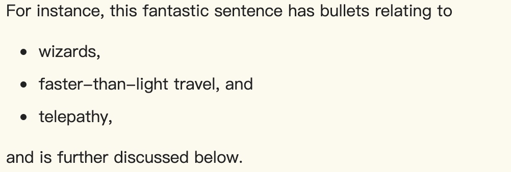

## 4.4 分组内容
### 4.4.1 p 元素
**元素定义**
1. **类别：**
    1. 流内容
    2. 可感知内容
2. **可以使用此元素的上下文：**
    1. 流内容里的任何地方
3. **内容模型：** 
    1. 短语内容
4. **标签省略：**
    1. 如果 p 元素紧随其后的是 address，article，aside，blockquote，details，div，dl，fieldset，figcaption，figure，footer，form，h1，h2，h3，h4，h5，h6，header，hr，main，nav，ol，p，pre，section，table 或 ul，元素，或者如果父元素中没有更多内容，并且父元素不是 a，audio，del，ins，map，noscript 或 video 元素的 HTML 元素，则可以省略 p 元素的结束标记。
5. **内容属性：**
    1. 全局属性
6. **允许的 `ARIA role attribute values`：**
    1. 任何 role 值
7. **允许的 `Allowed ARIA state and property attributes`：**
    1. 全局 aria-* 属性
    2. 适用于默认角色的任何 aria-* 属性
8. **DOM 接口：**

    ```ts
    interface HTMLParagraphElement : HTMLElement {};
    ```

p 元素表示一个段落。

> 注意
>
> 尽管段落通常在可视化媒体中由文本块表示，但文本块之间通过空白行与相邻的块物理分隔，但样式表或用户代理会以不同方式呈现段落分隔符（例如使用内联pilcrows（¶））时一样。

> 示例 1
>
> 以下示例是符合标准的 HTML 片段：
> ```html
> <p>The little kitten gently seated itself on a piece of
> carpet. Later in his life, this would be referred to as the time the
> cat sat on the mat.</p>
> ```
> ```html
> <fieldset>
>   <legend>Personal information</legend>
>   <p>
>     <label>Name: <input name="n"></label>
>     <label><input name="anon" type="checkbox"> Hide from other users</label>
>   </p>
>   <p><label>Address: <textarea name="a"></textarea></label></p>
> </fieldset>
> ```
> ```html
> <p>There was once an example from Femley,<br>
> Whose markup was of dubious quality.<br>
> The validator complained,<br>
> So the author was pained,<br>
> To move the error from the markup to the rhyming.</p>
> ```

当有更具体的元素更合适时，不应使用 p 元素。

> 示例 2
>
> 以下示例在专业上是正确的：
>
> ```html
> <section>
>   <!-- ... -->
>   <p>Last modified: 2001-04-23</p>
>   <p>Author: fred@example.com</p>
> </section>
> ```
>
> 但是，最好将其标记为：
>
> ```html
> <section>
>   <!-- ... -->
>   <footer>Last modified: 2001-04-23</footer>
>   <address>Author: fred@example.com</address>
> </section>
> ```
>
> 或
>
> ```html
> <section>
>   <!-- ... -->
>   <footer>
>   <p>Last modified: 2001-04-23</p>
>   <address>Author: fred@example.com</address>
>   </footer>
> </section>
> ```

> 注意
>
> 列表元素（尤其是 ol 和 ul 元素）不能是 p 元素的子元素。因此，当句子包含项目符号列表时，您可能会想知道如何标记它。
>
> 示例 3
>
>     
> 解决方案是认识到用 HTML 术语表示的段落并不是逻辑概念，而是结构性概念。 在上面的奇妙示例中，此规范实际上定义了五段：列表之前的一段，每个项目符号一段，列表之后的一段。  
>
> 示例 4
>
> ```html
> <p>For instance, this fantastic sentence has bullets relating to</p>
> <ul>
>   <li>wizards,
>   <li>faster-than-light travel, and
>   <li>telepathy,
> </ul>
> <p>and is further discussed below.</p>
> ```
>
> 作者希望能够方便地样式化由多个 “结构” 段落组成的 “逻辑” 段落，可以使用 div 元素代替 p 元素。
>
> 示例 5
>
> 因此，例如，上面的示例可能变为以下示例：
>
> ```html
> <div>For instance, this fantastic sentence has bullets relating to
>   <ul>
>     <li>wizards,
>     <li>faster-than-light travel, and
>     <li>telepathy,
>   </ul>
> and is further discussed below.</div>
> ```
>
> 这个示例仍然有五个结构段落，但是现在作者可以仅对 div 进行样式设置，而不必分别考虑示例的每个部分。
> 通常，不能是 p 元素的子级元素的元素包括任何行内块，行内表以及浮动和块级定位元素。

### 4.4.2 address 元素
**元素定义**
1. **类别：**
    1. 流内容
    2. 可感知内容
2. **可以使用此元素的上下文：**
    1. 流内容里的任何地方
3. **内容模型：** 
    1. 流内容，但没有标题内容后代，没有节内容后代，也没有 header，footer，address 元素后代
4. **标签省略：**
    1. 这两个标签都不可省略
5. **内容属性：**
    1. 全局属性
6. **允许的 `ARIA role attribute values`：**
    1. 任何 role 值
7. **允许的 `Allowed ARIA state and property attributes`：**
    1. 全局 aria-* 属性
    2. 适用于默认角色的任何 aria-* 属性
8. **DOM 接口：**
    
    ```ts
    interface HTMLParagraphElement : HTMLElement {};
    ```

address 元素表示个人，人员或组织的联系信息。它包括身体 和/或 数字位置/联系信息，以及识别信息所属的个人或组织的方式。

> 示例 6
>
> 例如，W3C Twitter 帐户：
>
> ```html
> <address>
> <p>W3C on Twitter:
> <p><a href="https://twitter.com/w3c">@w3c</a>
> </address> 
> ```
>
> 组织的地址，电话和传真号码：
>
> ```html
> <address>
> UNIVERSITY INTERSCHOLASTIC LEAGUE<br>
> 1701 Manor Road, Austin, TX 78722<br>
> Tel: (512) 471-5883 | Fax: (512) 471-5908
> </address>
> ```
>
> 表单输出的地址部分：
>
> ```html
> ...
> <label for="name">Name:</label> <input type="text" id="name">
> <label for="hn">House number:</label> <input type="text" id="hn">
> <label for="street">Street:</label> <input type="text" id="street">
> ...
> <address>
> <p>Name: Hament Dhanji
> <p>House number: 1976
> <p>Street: Meadowband Road
> ...
> </address>
> ```
>
> 猫的位置
>
> ```html
> <address>Lola the cat is at
> Latitude: 51.413126
> Longtitude: -0.298219
> </address>
> ```
>

address 元素的含义和用法范围很广。如果开发人员希望为 address 元素提供更详细的语义，则建议使用各种语义 Web 元数据模式中的任何一种。

> 示例 7
>
> 例如，使用 RDFa 注解的本地公司的邮政地址：
>
> ```html
> <div vocab="http://schema.org/" typeof="LocalBusiness">
> <h1><span property="name">Beachwalk Beachwear & Giftware</span></h1>
> <span property="description"> A superb collection of fine gifts and clothing
> to accent your stay in Mexico Beach.</span>
> <address property="address" typeof="PostalAddress">
> <span property="streetAddress">3102 Highway 98</span>
> <span property="addressLocality">Mexico Beach</span>,
> <span property="addressRegion">FL</span>
> </address>
> Phone: <span property="telephone">850-648-4200</span>
> </div>
> ```
>

### 4.4.3 hr 元素
**元素定义**
1. **类别：**
    1. 流内容
2. **可以使用此元素的上下文：**
    1. 流内容里的任何地方
3. **内容模型：**
    1. 空
4. **标签省略：**
    1. 这两个标签都不可省略
5. **内容属性：**
    1. 全局属性
6. **允许的 `ARIA role attribute values`：**
    1. separator（默认 - 不设置）, separator
7. **允许的 `Allowed ARIA state and property attributes`：**
    1. 全局 aria-* 属性
    2. 适用于默认角色的任何 aria-* 属性
8. **DOM 接口：**

    ```ts
    interface HTMLHRElement : HTMLElement {};
    ```

hr 元素表示段落级别的主题中断，例如故事中的场景更改，或在参考书的某个部分中过渡到另一个主题。

> 示例 8
>
> 以下项目手册的虚构摘录显示了两个部分，这些部分使用hr元素在该部分中分隔主题。
>
> ```html
> <section>
>   <h1>Communication</h1>
>   <p>There are various methods of communication. This section
>   covers a few of the important ones used by the project.</p>
>   <hr>
>   <p>Communication stones seem to come in pairs and have mysterious
>   properties:</p>
>   <ul>
>     <li>They can transfer thoughts in two directions once activated
>     if used alone.</li>
>     <li>If used with another device, they can transfer one’s
>     consciousness to another body.</li>
>     <li>If both stones are used with another device, the
>     consciousnesses switch bodies.</li>
>   </ul>
>   <hr>
>   <p>Radios use the electromagnetic spectrum in the meter range and
>   longer.</p>
>   <hr>
>   <p>Signal flares use the electromagnetic spectrum in the
>   nanometer range.</p>
> </section>
> <section>
>   <h1>Food</h1>
>   <p>All food at the project is rationed:</p>
>   <dl>
>     <dt>Potatoes</dt>
>     <dd>Two per day</dd>
>     <dt>Soup</dt>
>     <dd>One bowl per day</dd>
>   </dl>
>   <hr>
>   <p>Cooking is done by the chefs on a set rotation.</p>
> </section>
> ```
>
> 在 section 之间不需要 hr 元素，因为 section 元素和 h1 元素暗示着主题本身发生了变化。
>

> 示例 9
>
> Peter F. Hamilton 摘录的潘多拉星球（Pandora's Star）显示了场景更改之前的两个段落以及场景更改之后的段落。场景变化在印刷书籍中由第二段和第三段之间的包含孤立中心星的间隙表示，此处使用 hr 元素表示。
>
> ```html
> <p>Dudley was ninety-two, in his second life, and fast approaching
> time for another rejuvenation. Despite his body having the physical
> age of a standard fifty-year-old, the prospect of a long degrading
> campaign within academia was one he regarded with dread. For a
> supposedly advanced civilization, the Intersolar Commonwealth could be
> appallingly backward at times, not to mention cruel.</p>
> <p><i>Maybe it won’t be that bad</i>, he told himself. The lie was
> comforting enough to get him through the rest of the night’s
> shift.</p>
> <hr>
> <p>The Carlton AllLander drove Dudley home just after dawn. Like the
> astronomer, the vehicle was old and worn, but perfectly capable of
> doing its job. It had a cheap diesel engine, common enough on a
> semi-frontier world like Gralmond, although its drive array was a
> thoroughly modern photoneural processor. With its high suspension and
> deep-tread tyres it could plough along the dirt track to the
> observatory in all weather and seasons, including the metre-deep snow
> of Gralmond’s winters.</p>
> ```

> 注意
>
> hr 元素不会影响文档的大纲。

### 4.4.4 pre 元素
**元素定义**
1. **类别：**
    1. 流内容
    2. 可感知内容
2. **可以使用此元素的上下文：**
    1. 流内容里的任何地方
3. **内容模型：** 
    1. 短语内容
4. **标签省略：**
    1. 这两个标签都不可省略
5. **内容属性：**
    1. 全局属性
6. **允许的 `ARIA role attribute values`：**
    1. separator（默认 - 不设置）, separator
7. **允许的 `Allowed ARIA state and property attributes`：**
    1. 全局 aria-* 属性
    2. 适用于默认角色的任何 aria-* 属性
8. **DOM 接口：**
    
    ```ts
    interface HTMLPreElement : HTMLElement {};
    ```

pre 元素代表一块预格式化的文本，其中结构由印刷约定而不是元素表示。

> 注意
>
> 在 HTML 语法中，会剥去紧接在 pre 元素开始标记之后的前导换行符。

> 示例 11
>
> 在以下代码段中，将 samp 和 kbd 元素混合在 pre 元素的内容中，以显示 Zork I 的对话。
>
> ```html
> <pre><samp>You are in an open field west of a big white house with a boarded
> front door.
> There is a small mailbox here.
> ></samp> <kbd>open mailbox</kbd>
> <samp>Opening the mailbox reveals:
> A leaflet.
> ></samp></pre>
> ```
>

> 示例 12
> 下图显示了一首当代诗歌，该诗歌使用 pre 元素保留其不寻常的格式，这是诗歌本身的内在部分。
>
> ```html
> <pre>                maxling
> it is with a          heart
>                 heavy
> that i admit loss of a feline
>         so           loved
> a friend lost to the
>         unknown
>                                 (night)
> ~cdr 11dec07</pre>
> ```

### 4.4.5 blockquote 元素
**元素定义**
1. **类别：**
    1. 流内容
    2. 节的根
    3. 可感知内容
2. **可以使用此元素的上下文：**
    1. 流内容里的任何地方
3. **内容模型：** 
    1. 流内容
4. **标签省略：**
    1. 这两个标签都不可省略
5. **内容属性：**
    1. 全局属性
    2. cite：链接引用来源
6. **允许的 `ARIA role attribute values`：**
    1. 任何 role 角色
7. **允许的 `Allowed ARIA state and property attributes`：**
    1. 全局 aria-* 属性
    2. 适用于默认角色的任何 aria-* 属性
8. **DOM 接口：**

    ```ts
    interface HTMLQuoteElement : HTMLElement {
      attribute DOMString cite;
    };
    ```

    > 注意
    >
    > 元素也使用 HTMLQuoteElement 接口

blockquote 元素表示从另一个来源引用的内容，可以选择带 在 footer 或 cite 元素内的引用，还可以带行内的变更（例如，注释和缩写）。

TODO

### 4.4.6 ol 元素
**元素定义**
1. **类别：**
    1. 流内容
    2. 如果元素的子元素包含至少一个 li 元素：可感知内容。
2. **可以使用此元素的上下文：**
    1. 流内容里的任何地方
3. **内容模型：** 
    1. 0 个或多个 li
    2. 支持脚本的元素
4. **标签省略：**
    1. 这两个标签都不可省略
5. **内容属性：**
    1. 全局属性
    2. reversed：列表向后编号
    3. start：第一项的序数值
    4. type：列表标记的种类
6. **允许的 `ARIA role attribute values`：**
    1. list role（默认 - 不设置）,directory, group, listbox, menubar, presentation, radiogroup, tablist, toolbar 或 tree.
7. **允许的 `Allowed ARIA state and property attributes`：**
    1. 全局 aria-* 属性
    2. 适用于默认角色的任何 aria-* 属性
8. **DOM 接口：**

    ```ts
    interface HTMLOListElement : HTMLElement {
      attribute boolean reversed;
      attribute long start;
      attribute DOMString type;
    };
    ```

ol 元素表示项目列表，其中的项目已被有意地排序，因此更改顺序将更改文档的含义。

TODO

### 4.4.7 ul 元素
**元素定义**
1. **类别：**
    1. 流内容
    2. 如果元素的子元素包含至少一个 li 元素：可感知内容。
2. **可以使用此元素的上下文：**
    1. 流内容里的任何地方
3. **内容模型：** 
    1. 0 个或多个 li
    2. 支持脚本的元素
4. **标签省略：**
    1. 这两个标签都不可省略
5. **内容属性：**
    1. 全局属性
    2. reversed：列表向后编号
    3. start：第一项的序数值
    4. type：列表标记的种类
6. **允许的 `ARIA role attribute values`：**
    1. list role（默认 - 不设置）,directory, group, listbox, menubar, presentation, radiogroup, tablist, toolbar 或 tree.
7. **允许的 `Allowed ARIA state and property attributes`：**
    1. 全局 aria-* 属性
    2. 适用于默认角色的任何 aria-* 属性
8. **DOM 接口：**

    ```ts
    interface HTMLUListElement : HTMLElement {};
    ```

ul 元素表示项目列表，其中项目的顺序并不重要，也就是说，更改顺序不会实质性改变文档的含义。

列表的项目是 ul 元素的 li 元素子节点。

> 示例 24
> 以下标记显示了顺序无关紧要的列表，因此 ul 元素适用于此。将此列表与 ol 部分中的等效列表进行比较，以查看使用 ol 元素的相同项目的示例。
> 
> ```html
> <p>I have lived in the following countries:</p>
> <ul>
>   <li>Norway
>   <li>Switzerland
>   <li>United Kingdom
>   <li>United States
> </ul>
> ```
>
> 请注意，更改列表的顺序不会更改文档的含义。 上面的代码段中的项目按字母顺序排列，但下面的代码段中的项目按2007年经常帐户余额的大小排列，但不改变文档的含义：
>
> ```html
> <p>I have lived in the following countries:</p>
> <ul>
>   <li>Switzerland
>   <li>Norway
>   <li>United Kingdom
>   <li>United States
> </ul>
> ```

### 4.4.8 li 元素
**元素定义**
1. **类别：**
    1. 无
2. **可以使用此元素的上下文：**
    1. 在 ol 元素里
    2. 在 ul 元素里
3. **内容模型：** 
    1. 流内容
4. **标签省略：**
    1. 如果 li 元素后面紧跟另一个 li 元素，或者如果父元素中没有更多内容，则可以省略li 元素的结束标签。
5. **内容属性：**
    1. 全局属性
    2. 如果该元素不是 ul 的子级：值
6. **允许的 `ARIA role attribute values`：**
    1. listitem role（默认 - 不设置）,option, presentation, radio, separator, tab 或 treeitem。
7. **允许的 `Allowed ARIA state and property attributes`：**
    1. 全局 aria-* 属性
    2. 适用于默认角色的任何 aria-* 属性
8. **DOM 接口：**

    ```ts
    interface HTMLLIElement : HTMLElement {
      attribute long value;
    };
    ```

li 元素表示一个列表项。如果其父元素是 ol 或 ul，则该元素是为其定义的父元素列表中的一项。否则，列表项与任何其他 li 元素都没有定义的列表相关关系。

TODO

### 4.4.9 dl 元素
**元素定义**
1. **类别：**
    1. 流内容
    2. 如果元素的子级包含至少一个 name/value 组：可感知内容。
2. **可以使用此元素的上下文：**
    1. 在 ol 元素里
    2. 在 ul 元素里
3. **内容模型：** 
    1. 零个或多个组，每个组由一个或多个 dt 元素，后跟一个或多个 dd 元素组成，并可选地与支持脚本的元素混合。
4. **标签省略：**
    1. 
5. **内容属性：**
    1. 全局属性
6. **允许的 `ARIA role attribute values`：**
    1. list role（默认 - 不设置）,group, presentation。
7. **允许的 `Allowed ARIA state and property attributes`：**
    1. 全局 aria-* 属性
    2. 适用于默认角色的任何 aria-* 属性
8. **DOM 接口：**
    
    ```ts
    interface HTMLDListElement : HTMLElement {};
    ```

dl 元素表示零个或多个术语描述组的描述列表。每个术语描述组由一个或多个可能由 div 元素子级的子级组成的术语（由 dt 元素表示）和一个或多个描述（由 dd 元素可能表示 div 元素子级的子级组成）组成，而忽略其他节点 而不是 dt 和 dd 元素的子元素，以及作为单个 dl 元素中 div 元素的子元素的子元素的 dt 和 dd 元素。

### 4.4.10 dt 元素

### 4.4.11 dd 元素

### 4.4.12 figure 元素
**元素定义**
1. **类别：**
    1. 流内容
    2. 节的根
    3. 可感知内容
2. **可以使用此元素的上下文：**
    1. 流内容里的任何地方
3. **内容模型：** 
    1. 流内容，可选地包含 figcaption 子元素
4. **标签省略：**
    1. 这两个标签都不可省略
5. **内容属性：**
    1. 全局属性
6. **允许的 `ARIA role attribute values`：**
    1. figure role（默认 - 不设置）,group, presentation。
7. **允许的 `Allowed ARIA state and property attributes`：**
    1. 全局 aria-* 属性
    2. 适用于默认角色的任何 aria-* 属性
8. **DOM 接口：**
    使用 HTMLElement

figure 元素表示一些流内容，可选地包含标题，这些内容是独立的（如完整的句子），通常从文档的主要流（原：main flow）中引用为单个单元。

> 注意  
> 在本文中，“独立” 不一定意味着独立。例如，段落中的每个句子都是独立的；作为句子一部分的图像不适合用于 figure，但由图像构成的整个句子将很合适。

因此，该元素可用于注解插图，图表，照片，代码清单等。

> 注意  
TODO


### 4.4.13 figcaption 元素
**元素定义**
1. **类别：**
    1. 无
2. **可以使用此元素的上下文：**
    1. 作为 figure 元素的后代
3. **内容模型：** 
    1. 流内容
4. **标签省略：**
    1. 这两个标签都不可省略
5. **内容属性：**
    1. 全局属性
6. **允许的 `ARIA role attribute values`：**
    1. main role（默认 - 不设置）, presentation。
7. **允许的 `Allowed ARIA state and property attributes`：**
    1. 全局 aria-* 属性
    2. 适用于默认角色的任何 aria-* 属性
8. **DOM 接口：**
    使用 HTMLElement

figcaption 元素表示 figcaption 元素的父级 figure 元素（如果有的话）的其余内容的标题或图例。

### 4.4.14 main 元素
**元素定义**
1. **类别：**
    1. 流内容
    2. 可感知内容
2. **可以使用此元素的上下文：**
    1. 流内容里的任何地方，但是祖先元素不能有 article, aside, footer, header 或 nav 
3. **内容模型：** 
    1. 流内容
4. **标签省略：**
    1. 这两个标签都不可省略
5. **内容属性：**
    1. 全局属性
6. **允许的 `ARIA role attribute values`：**
    1. main role（默认 - 不设置）, presentation。
7. **允许的 `Allowed ARIA state and property attributes`：**
    1. 全局 aria-* 属性
    2. 适用于默认角色的任何 aria-* 属性
8. **DOM 接口：**
    使用 HTMLElement

main 元素表示文档或应用程序正文的主要内容。

> 注意
>
> main 元素不是节内容，并且对文档大纲没有影响。

文档的主要内容区域包含该文档唯一的内容，不包括在一组文档中重复的内容，例如网站导航链接，版权信息，网站徽标和横幅以及搜索表单（除非文档或应用程序的主要功能就是搜索表单）。

一个文档中最多只能有一个可见的 main 元素。如果在文档中存在多个 main 元素，则必须使用§5.1 “hidden” 属性隐藏所有其他实例。

> 示例 38 
>
>```html
><!-- conforming example -->
><main>...</main>
><main hidden>...</main>
><main hidden>...</main>
><!-- non-conforming example -->
><main>...</main>
><main>...</main>
><main>...</main>
>```
>

作者不得将 main 元素作为 article, aside, footer, header 或 nav 元素的后代。

> 注意
>
> main 元素不适合用于标识文档或应用程序的子节（原：sub sections）的主要内容区域。最简单的解决方案是根本不标记子节的主要内容，而只是将其保留为隐式，但是作者可以根据需要使用 §4.4 分组内容或节内容元素。

> 示例 39
>
> ```html
> <!-- other content -->
> 
> <main>
> 
>   <h1>Skateboards</h1>
>   <p>The skateboard is the way cool kids get around</p>
> 
>   <article>
>     <h2>Longboards</h2>
>     <p>Longboards are a type of skateboard with a longer
>     wheelbase and larger, softer wheels.</p>
>     <p>... </p>
>     <p>... </p>
>   </article>
> 
>   <article>
>     <h2>Electric Skateboards</h2>
>     <p>These no longer require the propelling of the skateboard
>     by means of the feet; rather an electric motor propels the board,
>     fed by an electric battery.</p>
>     <p>... </p>
>     <p>... </p>
>   </article>
> 
> </main>
> 
> <!-- other content -->
> ```
>

这是一个毕业计划，其中主要内容部分是通过使用 main 元素来定义的。请注意，在此示例中，main 元素包含一个 nav 元素，该 nav 元素包含指向主要内容的子部分的链接。

> 示例 40
>
> ```html
> <!DOCTYPE html>
> <html lang="en">
>   <head>
>     <title>Graduation Ceremony Summer 2022</title>
>   </head>
>   <body>
> 
>     <header>The Lawson Academy:
>     <nav>
>       <ul>
>         <li><a href="courses.html">Courses</a></li>
>         <li><a href="fees.html">Fees</a></li>
>         <li><a>Graduation</a></li>
>       </ul>
>     </nav>
>     </header>
> 
>     <main>
> 
>       <h1>Graduation</h1>
> 
>       <nav>
>         <ul>
>           <li><a href="#ceremony">Ceremony</a></li>
>           <li><a href="#graduates">Graduates</a></li>
>           <li><a href="#awards">Awards</a></li>
>         </ul>
>       </nav>
> 
>       <h2 id="ceremony">Ceremony</h2>
>       <p>Opening Procession</p>
>       <p>Speech by Valedictorian</p>
>       <p>Speech by Class President</p>
>       <p>Presentation of Diplomas</p>
>       <p>Closing Speech by Headmaster</p>
> 
>       <h2 id="graduates">Graduates</h2>
>       <ul>
>         <li>Eileen Williams</li>
>         <li>Andy Maseyk</li>
>         <li>Blanca Sainz Garcia</li>
>         <li>Clara Faulkner</li>
>         <li>Gez Lemon</li>
>         <li>Eloisa Faulkner</li>
>       </ul>
> 
>       <h2 id="awards">Awards</h2>
>       <ul>
>         <li>Clara Faulkner</li>
>         <li>Eloisa Faulkner</li>
>         <li>Blanca Sainz Garcia</li>
>       </ul>
> 
>     </main>
> 
>     <footer> Copyright 2012 B.lawson</footer>
> 
>   </body>
> </html>
> ```
>

在下一个示例中，header 和 footer 都在 main 元素之外，因为它们是网站通用的，而不是 main 内容特有的。

> 示例 41
>
> ```html
> <!DOCTYPE html>
> <html lang="en">
>   <head>
>     <title>Great Dogs for Families</title>
>   </head>
>   <body>
> 
>     <header>
>       <h1>The Border Terrier</h1>
>       <nav>
>         <ul>
>           <li><a href="index.html">Home</a></li>
>           <li><a href="about.html">About</a></li>
>           <li><a href="health.html">Health</a></li>
>         </ul>
>       </nav>
>     </header>
>     <main>
>       <h2>Welcome!</h2>
>       <p>This site is all about the Border Terrier, the best breed of dog
>       that there is!</p>
>     </main>
>     <footer>
>       <small>Copyright © <time datetime="2013">2013</time> by I. Devlin</small>
>     </footer>
> 
>   </body>
> </html>
> ```
>

在这里，相同通用的 header 和 footer 元素保留在 main 外部，但是 main 元素中还有一个额外的 header 元素，因为其内容与 main 中的内容相关，因为它包含相关的标题和页面内导航。在 footer 中重复页面内导航，而 footer 又在 main 元素内。

> 示例 42
>
> ```html
> <!DOCTYPE html>
> <html lang="en">
>   <head>
>     <title>Great Dogs for Families</title>
>   </head>
>   <body>
> 
>     <header>
>       <h1>The Border Terrier</h1>
>       <nav>
>         <ul>
>           <li><a href="index.html">Home</a></li>
>           <li><a href="about.html">About</a></li>
>           <li><a href="health.html">Health</a></li>
>         </ul>
>       </nav>
>     </header>
>     <main>
>       <section>
>         <header>
>           <h2>About</h2>
>           <nav>
>             <ul>
>               <li><a href="#basic">Basic</a></li>
>               <li><a href="#app">Appearance</a></li>
>               <li><a href="#temp">Temperament</a></li>
>             </ul>
>           </nav>
>         </header>
>         <section id="basic">
>           <h3>Basic Information</h3>
>           <p>The Border Terrier is a small, rough-coated breed of
>           dog of the terrier group, originally bred as fox and vermin
>           hunters. [...]</p>
>         </section>
>         <section id="app">
>           <h3>Appearance</h3>
>           <p>Identifiable by their otter-shaped heads, Border Terriers
>           have a broad skull and short (although many be fairly long),
>           strong muzzle with a scissors bite. [...]</p>
>         </section>
>         <section id="temp">
>           <h3>Temperament</h3>
>           <p>Though sometimes stubborn and strong willed, border terriers
>           are, on the whole very even tempered, and are friendly and rarely
>           aggressive. [...] </p>
>         </section>
>         <footer>
>           <a href="#basic">Basic</a> -
>           <a href="#app">Appearance</a> -
>           <a href="#temp">Temperament</a>
>         </footer>
>       </section>
>     </main>
>     <footer>
>       <small>Copyright © <time datetime="2013">2013</time> by I. Devlin</small>
>     </footer>
> 
>   </body>
> </html>
> ```
>

此示例与上一个示例基本相同，不同之处在于它包含一个 aside。aside 的内容被认为与 main 元素内的内容有关，而这一切都与 “Border Terrier” 有关，因此 aside 被放置在 main 元素内。

> 示例 43
>
> ```html
> <!DOCTYPE html>
> <html lang="en">
>   <head>
>     <title>Great Dogs for Families</title>
>   </head>
>   <body>
> 
>     <header>
>       <h1>The Border Terrier</h1>
>       <nav>
>         <ul>
>           <li><a href="index.html">Home</a></li>
>           <li><a href="about.html">About</a></li>
>           <li><a href="health.html">Health</a></li>
>         </ul>
>       </nav>
>     </header>
>     <main>
>       <section>
>         <header>
>           <h2>About</h2>
>           <nav>
>             <ul>
>               <li><a href="#basic">Basic</a></li>
>               <li><a href="#app">Appearance</a></li>
>               <li><a href="#temp">Temperament</a></li>
>             </ul>
>           </nav>
>         </header>
>         <section id="basic">
>           <h3>Basic Information</h3>
>           <p>The Border Terrier is a small, rough-coated breed of
>           dog of the terrier group, originally bred as fox and vermin
>           hunters. [...]</p>
>         </section>
>         <section id="app">
>           <h3>Appearance</h3>
>           <p>Identifiable by their otter-shaped heads, Border Terriers
>           have a broad skull and short (although many be fairly long),
>           strong muzzle with a scissors bite. [...]</p>
>         </section>
>         <section id="temp">
>           <h3>Temperament</h3>
>           <p>Though sometimes stubborn and strong willed, border terriers
>           are, on the whole very even tempered, and are friendly and rarely
>           aggressive. [...] </p>
>         </section>
>         <aside>
>           <h3>History</h3>
>           <p>The Border Terrier originates in, and takes its name from the
>           Scottish borders. [...] </p>
>         </aside>
>         <footer>
>           <a href="#basic">Basic</a> -
>           <a href="#app">Appearance</a> -
>           <a href="#temp">Temperament</a>
>         </footer>
>       </section>
>     </main>
>     <footer>
>       <small>Copyright © <time datetime="2013">2013</time> by I. Devlin</small>
>     </footer>
> 
>   </body>
> </html>
> 
> ```
>

在下面的示例中，两个包含广告的 aside 元素已放置在 main 元素外部，因为它们的内容并非特定于 main 内的内容。这些辅助对象可以在任何页面上，因为它们与所示的 header 和 footer 一样通用。

> 示例 44
>
> ```html
> <!DOCTYPE html>
> <html lang="en">
>   <head>
>     <title>Great Dogs for Families</title>
>   </head>
>   <body>
> 
>     <header>
>       <h1>The Border Terrier</h1>
>       <nav>
>         <ul>
>           <li><a href="index.html">Home</a></li>
>           <li><a href="about.html">About</a></li>
>           <li><a href="health.html">Health</a></li>
>         </ul>
>       </nav>
>     </header>
>     <main>
>       <h2>Welcome!</h2>
>       <p>This site is all about the Border Terrier, the best breed of dog
>       that there is!</p>
>     </main>
>     <aside class="advert">
>       <h2>Border Farm Breeders</h2>
>       <p>We are a certified breeder of Border Terriers, contact us at...</p>
>     </aside>
>     <aside class="advert">
>       <h2>Grumpy’s Pet Shop</h2>
>       <p>Get all your pet’s needs at our shop!</p>
>     </aside>
> 
>     <footer>
>       <small>Copyright © <time datetime="2013">2013</time> by I. Devlin</small>
>     </footer>
> 
>   </body>
> </html>
> 
> ```

### 4.4.15 div 元素
**元素定义**
1. **类别：**
    1. 流内容
    2. 可感知内容
2. **可以使用此元素的上下文：**
    1. 流内容里的任何地方
    2. 作为 dl 元素的子级
3. **内容模型：**
    1. 如果该元素是 dl 元素的子元素：一个或多个dt元素，然后是一个或多个dd元素，并可选地与支持脚本的元素混合。
    2. 如果该元素不是 dl 元素的子元素：流内容。
4. **标签省略：**
    1. 这两个标签都不可省略
5. **内容属性：**
    1. 全局属性
6. **允许的 `ARIA role attribute values`：**
    1. list role（默认 - 不设置）,group, presentation。
7. **允许的 `Allowed ARIA state and property attributes`：**
    1. 全局 aria-* 属性
    2. 适用于默认角色的任何 aria-* 属性
8. **DOM 接口：**

    ```ts
    interface HTMLDivElement : HTMLElement {};
    ```

div 元素根本没有特殊含义。它表示它的子级。它可以与 class，lang 和 title 属性一起使用，以标记一组连续元素共有的语义。

> 注意
>
>强烈建议作者将 div 元素视为最后选择的元素，因为在没有其他元素适合的情况下。使用更合适的元素而不是 div 元素，这样可以为读者提供更好的可访问性，并为作者提供更易于维护的功能。

> 示例
>
> 例如，将使用 article 标记博客文章，使用 section 标记章节，使用 nav 标记页面的导航工具，以及使用 fieldset 标记一组表单控件。
> 一方面，div元素 可用于样式目的或将一个段落中的多个段落包装在一起，而所有段落都将以类似的方式进行注释。 在以下示例中，我们将 div 元素用作一次设置两个段落的语言的方法，而不是分别在两个段落元素上设置语言：
>```html
><article lang="en-US">
>  <h2>My use of language and my cats</h2>
>  <p>My cat’s behavior hasn’t changed much since her absence, except
>  that she plays her new physique to the neighbors regularly, in an
>  attempt to get pets.</p>
>  <div lang="en-GB">
>  <p>My other cat, colored black and white, is a sweetie. He followed
>  us to the pool today, walking down the pavement with us. Yesterday
>  he apparently visited our neighbours. I wonder if he recognizes that
>  their flat is a mirror image of ours.</p>
>  <p>Hm, I just noticed that in the last paragraph I used British
>  English. But I’m supposed to write in American English. So I
>  shouldn’t say "pavement" or "flat" or "color"...</p>
>  </div>
>  <p>I should say "sidewalk" and "apartment" and "color"!</p>
></article>
>```
>