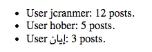
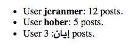

## 4.5 文本级语义
### 4.5.1 a 元素
**元素定义**
1. **类别：**
    1. 流内容
    2. 短语内容
    3. 如果元素有 href 属性：可交互内容
    4. 可感知内容
2. **可以使用此元素的上下文：**
    1. 短语内容里的任何地方
3. **内容模型：**
    1. 透明，但后代必须没有可交互内容或 a 元素
4. **标签省略：**
    1. 这两个标签都不可省略
5. **内容属性：**
    1. 全局属性
    2. href - 超链接的地址
    3. target - 超链接导航和 §4.10.21 表单提交的默认浏览上下文
    4. download - 是下载资源而不是导航至资源，以及下载文件名
    5. rel - 本文档（或小节/主题）与目标资源的关系
    6. rev - 目标资源与本文档（或小节/主题）的反向链接关系
    7. hreflang - 链接资源的语言
    8. type - 提示所引用资源的类型
    9. referrerpolicy - 由元素发起请求的引用者策略

6. **允许的 `ARIA role attribute values`：**
    1. link（默认 - 没有设置）, button, checkbox, radio, switch, tab 或者 treeitem
7. **允许的 `Allowed ARIA state and property attributes`：**
    1. 全局 aria-* 属性
    2. 适用于默认角色的任何 aria-* 属性
8. **DOM 接口：**

    ```ts
    interface HTMLAnchorElement : HTMLElement {
    attribute DOMString target;
    attribute DOMString download;
    attribute DOMString rel;
    attribute DOMString rev;
    [SameObject, PutForwards=value] readonly attribute DOMTokenList relList;
    attribute DOMString hreflang;
    attribute DOMString type;
    attribute DOMString text;
    attribute DOMString referrerPolicy;
    };
    HTMLAnchorElement implements HTMLHyperlinkElementUtils;
    ```

如果 a 元素有 href 属性，则它表示其内容标记的超链接（超文本锚点）。

如果 a 元素没有 href 属性，则该元素表示一个占位符，否则可能会放置一个链接（如果存在的话），该链接只是由元素的内容组成。

如果 href 属性不存在，则必须省略 target, download, rel, rev, hreflang, type,  referrerpolicy 属性。

> 示例 1
> 如果站点在每个页面上使用一样的导航工具栏，则可以使用 a 元素标记通常链接到页面本身的链> 接：
>
> ```html
> <nav>
>   <ul>
>     <li> <a href="/">Home</a> </li>
>     <li> <a href="/news">News</a> </li>
>     <li> <a>Examples</a> </li>
>     <li> <a href="/legal">Legal</a> </li>
>   </ul>
> </nav>
> ```
>

TODO


### 4.5.2 em 元素
**元素定义**
1. **类别：**
    1. 流内容
    2. 短语内容
    3. 可感知内容
2. **可以使用此元素的上下文：**
    1. 短语内容里的任何地方
3. **内容模型：**
    1. 短语内容
4. **标签省略：**
    1. 这两个标签都不可省略
5. **内容属性：**
    1. 全局属性
6. **允许的 `ARIA role attribute values`：**
    1. 任何 role 值
7. **允许的 `Allowed ARIA state and property attributes`：**
    1. 全局 aria-* 属性
    2. 适用于默认角色的任何 aria-* 属性
8. **DOM 接口：**
    使用 HTMLElement

em 元素表示强调其内容。

对特定的内容所具有的强调程度由其祖先 em 元素的数量决定。

重点强调的位置会改变句子的含义。因此，该元素构成内容的不可分割的一部分。使用这种方式来强调的具体方式取决于语言。

> 示例 3
>
> 这些示例说明了如何改变强调的重点导致改变含义。首先，不加任何强调地陈述事实：
> ```html
> <p>Cats are cute animals.</p>
> ```
> 
> 通过强调第一个词，该语句暗示所讨论的动物种类存在疑问（也许有人说狗很可爱）：
> ```html
> <p><em>Cats</em> are cute animals.</p>
> ```
> 
> 将重音移到动词上，可以强调整个句子的真实性是有问题的（也许有人在说猫不是很可爱）：
> ```html
> <p>Cats <em>are</em> cute animals.</p>
> ```
> 
> 通过将其移至形容词，可以重新确定猫的确切性格（也许有人认为猫是狡猾的动物）：
> ```html
> <p>Cats are <em>cute</em> animals.</p>
> ```
> 
> 同样，如果有人说猫是蔬菜，那么纠正这一点的人可能会说出最后一句话：
> ```html
> <p>Cats are cute <em>animals</em>.</p>
> ```
> 
> 通过强调整个句子，可以清楚地看到说话者正在努力争取使观点更明确。这种强调重点通常也会影响标点符号，因此会引起感叹。
> ```html
> <p><em>Cats are cute animals!</em></p>
> ```
> 
> 愤怒加上强调可爱可能会导致标记如下：
> ```html
> <p><em>Cats are <em>cute</em> animals!</em></p>
> ```
>

> 注意
>
> em 元素不是通用的“斜体”元素。有时，文字的意图是使该段落的其余部分脱颖而出，就好像它的心情或声音不同。对于这种情况，i 元素更合适。
> 
> em 元素也不是为了传达重要性。对于这种情况，strong 元素更合适。
>

### 4.5.3 strong 元素
**元素定义**
1. **类别：**
    1. 流内容
    2. 短语内容
    3. 可感知内容
2. **可以使用此元素的上下文：**
    1. 短语内容里的任何地方
3. **内容模型：**
    1. 短语内容
4. **标签省略：**
    1. 这两个标签都不可省略
5. **内容属性：**
    1. 全局属性
6. **允许的 `ARIA role attribute values`：**
    1. 任何 role 值
7. **允许的 `Allowed ARIA state and property attributes`：**
    1. 全局 aria-* 属性
    2. 适用于默认角色的任何 aria-* 属性
8. **DOM 接口：**
    使用 HTMLElement

strong 元素表示其内容的强烈的重要性，严肃性或紧迫性。

重要性：可以在标题，说明或段落中使用 strong 元素，以将真正重要的部分与可能更详细，更活泼或仅是样板的其他部分区分开。

> 示例 4
>
> 例如，上一段的第一个单词被标记为 strong，以将其与该段其余部分中更详细的文本区分开。

严肃性：strong 元素可用于标记警告或注意通知。

紧迫性：strong 元素可用于表示用户需要比文档其他部分更早看到的内容。

内容重要性的相对等级由其祖先 strong 元素的数量决定；每个 strong 元素都会增加其内容的重要性。

使用 strong 元素可以更改一段文本的重要性但不会更改句子的含义。

> 示例 5
>
> 在这里，“chapter” 一词和实际的章节编号只是说明，章节的真正名称用 strong 标记了：
> 
> ```html
> <h1>Chapter 1: <strong>The Praxis</strong></h1>
> ```
> 
> 在下面的示例中，标题中的图名称说明使用了 strong，以与说明文本（之前）和描述（之后）区分开：
> 
> ```html
> <figcaption>Figure 1. <strong>Ant colony dynamics</strong>. The ants in this colony areaffected by the heat source (upper left) and the food source (lower right).</figcaption>
> ```
> 
> 在此示例中，标题实际上是 “Flowers, Bees, and Honey”，但是作者在标题中添加了一些轻松的内容。 因此，strong 元素用于标记第一部分，以区别于第二部分。
> 
> ```html
> <h1><strong>Flowers, Bees, and Honey</strong> and other things I don’t understand</h1>
> ```

> 示例 6
>
> 这是游戏中警告提示的示例，其中各个部分根据它们的重要性进行了标记：
> 
> ```html
> <p><strong>Warning.</strong> This dungeon is dangerous.
> <strong>Avoid the ducks.</strong> Take any gold you find.
> <strong><strong>Do not take any of the diamonds</strong>,
> they are explosive and <strong>will destroy anything within
> ten meters.</strong></strong> You have been warned.</p>
> ```

> 示例 7
>
> 在此示例中，strong 元素用于表示用户首先要阅读的文本部分。
> 
> ```html
> <p>Welcome to Remy, the reminder system.</p>
> <p>Your tasks for today:</p>
> <ul>
>   <li><p><strong>Turn off the oven.</strong></p></li>
>   <li><p>Put out the trash.</p></li>
>   <li><p>Do the laundry.</p></li>
> </ul>
> ```

### 4.5.4 small 元素
**元素定义**
1. **类别：**
    1. 流内容
    2. 短语内容
    3. 可感知内容
2. **可以使用此元素的上下文：**
    1. 短语内容里的任何地方
3. **内容模型：**
    1. 短语内容
4. **标签省略：**
    1. 这两个标签都不可省略
5. **内容属性：**
    1. 全局属性
6. **允许的 `ARIA role attribute values`：**
    1. 任何 role 值
7. **允许的 `Allowed ARIA state and property attributes`：**
    1. 全局 aria-* 属性
    2. 适用于默认角色的任何 aria-* 属性
8. **DOM 接口：**
    使用 HTMLElement

small 元素表示旁注，比如小字说明。

> 注意
>
> 小字说明通常是免责声明，警告，法律限制或版权。有时还会使用小字说明来注明出处或满足许可要求。
>

> 注意
>
> small 元素不会“淡化”或降低由 em 元素强调或由 strong 元素标记为重要文本的重要性。要将文本标记为不强调或不重要，只需分别不要用 em 或 strong 元素对其进行标记。

small 元素不应该被用于文本扩展的跨度，例如多个段落，列表或文本部分。它仅适用于短文本。例如，列出使用项的页面的文本，small 元素不是合适的选择：在这种情况下，该文本不是旁注，而是该网页的主要内容。

> 示例 8
>
在此示例中，small 元素用于指示酒店房间的价格中不包含增值税：

```html
<dl>
  <dt>Single room
  <dd>199 € <small>breakfast included, VAT not included</small>
  <dt>Double room
  <dd>239 € <small>breakfast included, VAT not included</small>
</dl>
```

> 示例 9
>
> 在第二个示例中，small 元素用于文章中的旁注。
> 
> ```html
> <p>Example Corp today announced record profits for the
> second quarter <small>(Full Disclosure: Foo News is a subsidiary of
> Example Corp)</small>, leading to speculation about a third quarter
> merger with Demo Group.</p>
> ```
> 
> 这与侧边栏不同，侧边栏可能有多个长段落，并已从主要文本中删除。在以下示例中，我们看到同一篇文章的侧边栏。此侧边栏也有小字说明，指示侧边栏中的信息来源。
> 
> ```html
> <aside>
>   <h1>Example Corp</h1>
>   <p>This company mostly creates small software and Web
>   sites.</p>
>   <p>The Example Corp company mission is "To provide entertainment
>   and news on a sample basis".</p>
>   <p><small>Information obtained from <a
>   href="https://example.com/about.html">example.com</a> home
>   page.</small></p>
> </aside>
> ```
> 
> 在最后一个示例中，small 元素被标记为重要的小字说明。
> 
> ```html
> <p><strong><small>Continued use of this service will result in a kiss.</small></strong></p>
> ```
>

### 4.5.5 s 元素
**元素定义**
1. **类别：**
    1. 流内容
    2. 短语内容
    3. 可感知内容
2. **可以使用此元素的上下文：**
    1. 短语内容里的任何地方
3. **内容模型：**
    1. 短语内容
4. **标签省略：**
    1. 这两个标签都不可省略
5. **内容属性：**
    1. 全局属性
6. **允许的 `ARIA role attribute values`：**
    1. 任何 role 值
7. **允许的 `Allowed ARIA state and property attributes`：**
    1. 全局 aria-* 属性
    2. 适用于默认角色的任何 aria-* 属性
8. **DOM 接口：**
    使用 HTMLElement

s 元素表示不再准确或不再相关的内容。

> 注意
>
> 当文档在编辑时，s 元素不合适。要将一部分的文本标记为已从文档中删除，请使用 del 元素。
>

> 示例 10
>
> 在此示例中，由于所讨论的产品有新的销售价格，因此建议的零售价格已被标记为不再相关。
> 
> ```html
> <p>Buy our Iced Tea and Lemonade!</p>
> <p><s>Recommended retail price: $3.99 per bottle</s></p>
> <p><strong>Now selling for just $2.99 a bottle!</strong></p>
> ```
> 

### 4.5.6 cite 元素
**元素定义**
1. **类别：**
    1. 流内容
    2. 短语内容
    3. 可感知内容
2. **可以使用此元素的上下文：**
    1. 短语内容里的任何地方
3. **内容模型：**
    1. 短语内容
4. **标签省略：**
    1. 这两个标签都不可省略
5. **内容属性：**
    1. 全局属性
6. **允许的 `ARIA role attribute values`：**
    1. 任何 role 值
7. **允许的 `Allowed ARIA state and property attributes`：**
    1. 全局 aria-* 属性
    2. 适用于默认角色的任何 aria-* 属性
8. **DOM 接口：**
    使用 HTMLElement

cite 元素表示对创意作品的引用。它必须包括作品的标题或作者的名称（个人，群体或组织），或 URL 引用，或根据添加引用元数据所使用的约定的缩写形式的引用。

> 注意
>
> 创意作品包括书籍，论文，短文，诗歌，乐谱，歌曲，剧本，电影，电视节目，游戏，雕塑，绘画，戏剧作品，戏剧，歌剧， 音乐剧，展览，法律案例报告，计算机程序，网站，网页，博客文章或评论，论坛文章或评论，推文，书面或口头陈述等。
>

> 示例 11
>
> 这是使用 cite 元素引用的作者 示例：
> 
> ```html
> <p>In the words of <cite>Charles Bukowski</cite> -
> <q>An intellectual says a simple thing in a hard way. An artist says a hard thing in a simple way.</q></p>
> ```

> 示例 12
>
> 第二个示例通过使用 cite 元素引用作者姓名来标识推文的作者：
> 
> ```html
> <blockquote class="twitter-tweet">
> <p>♥ Bukowski in <a href="https://twitter.com/search?q=%23HTML5&src=hash">#HTML5</a> spec examples
> <a href="https://t.co/0FIEiYN1pC">https://t.co/0FIEiYN1pC</a></p><cite>— karl dubost (@karlpro)
> <a href="https://twitter.com/karlpro/statuses/370905307293442048">August 23, 2013</a></cite>
> </blockquote>
> ```

> 示例 13
>
> 在此示例中，cite 元素用于引用参考书目中的作品标题：
> 
> ```html
> <p><cite>Universal Declaration of Human Rights</cite>, United Nations,
> December 1948. Adopted by General Assembly resolution 217 A (III).</p>
> ```

> 示例 14
>
> 在此示例中，cite 元素用于引用电视节目的标题：
> 
> ```html
> <p>Who is your favorite doctor (in <cite>Doctor Who</cite>)?</p>
> ```

> 示例 15
>
> cite 元素的一种非常常见的用法是在博客文章或论坛中标识评论的作者，如本例所示：
> 
> ```html
> <article id="comment-1">
>   Comment by <cite><a href="https://oli.jp">Oli Studholme</a></cite>
>   <time datetime="2013-08-19T16:01">August 19th, 2013 at 4:01 pm</time>
>   <p>Unfortunately I don’t think adding names back into the definition of <code>cite</code>
>   solves the problem: of the 12 blockquote examples in
>   <a href="https://oli.jp/example/blockquote-metadata/">Examples of block quote metadata</a>,
>   there’s not even one that’s <em>just</em> a person’s name.</p>
>   <p>A subset of the problem, maybe…</p>
> </article>
> ```

> 示例 16
>
> cite 元素的另一个常见用法是引用搜索结果的 URL，如本例所示：
> 
> ```html
> <div id="resultStats">About 416,000,000 results 0.33 seconds) </div>
> ...
> <p><a href="https://www.w3.org/html/wg/">W3C <i>HTML Working Group</i></a></p>
> <p><cite>www.w3.org/<b>html</b>/wg/</cite></p>
> <p>15 Apr 2013 - The <i>HTML Working Group</i> is currently chartered to continue its
> work through 31 December 2014. A Plan 2014 document published by the...</p>
> ...
> ```

> 示例 17
>
> cite 元素用于标识缩写引用（例如同上）的地方。建议将此参考链接到基本参考：
> 
> ```html
> <article>
>   <h2>Book notes</h2>
>   ...
>   ...
>   <blockquote>"Money is the real cause of poverty,"
>   <footer>
>   <cite id="baseref">The Ragged-Trousered Philanthropists, page 89.</cite>
>   </footer>
>   </blockquote>
>   ...
>   ...
>   <blockquote>"Money is the cause of poverty because it is the device by which those who
>   are too lazy to work are enabled to rob the workers of the fruits of their labour."
>   <a href="#baseref"><cite>Ibid.</cite></a>
>   </blockquote>
>   ...
> </article>
> ```

> 注意
>
> 引用出处不是引用的句子（这个适合 q 元素）。

> 示例 18
>
> 这是不正确的用法，因为引用出处不是引用的句子：
> 
> ```html
> <p><cite>This is wrong!, said Hillary.</cite> is a quote from the
> popular daytime TV drama When Ian became Hillary.</p>
> ```
> 
> 这是正确用法的一个示例：
> 
> ```html
> <p><q>This is correct, said Hillary.</q> is a quote from the
> popular daytime TV drama <cite>When Ian became Hillary</cite>.</p>
> ```
> 

### 4.5.7 q 元素
**元素定义**
1. **类别：**
    1. 流内容
    2. 短语内容
    3. 可感知内容
2. **可以使用此元素的上下文：**
    1. 短语内容里的任何地方
3. **内容模型：**
    1. 短语内容
4. **标签省略：**
    1. 这两个标签都不可省略
5. **内容属性：**
    1. 全局属性
    2. edit - 链接到引文来源或关于编辑的更多信息
6. **允许的 `ARIA role attribute values`：**
    1. 任何 role 值
7. **允许的 `Allowed ARIA state and property attributes`：**
    1. 全局 aria-* 属性
    2. 适用于默认角色的任何 aria-* 属性
8. **DOM 接口：**
    使用 HTMLQuoteElement

q 元素表示从另一个来源引用的某些短语内容。

引用元素内容的引号标点符号（例如引号）不能紧接在 q 元素之前，之后或内部。它们将由用户代理插入渲染中。

q 元素中的内容必须引用另一个来源，如果引用的地址中有内容，则可以在 cite 属性中引用该地址。来源可能是虚构的，例如在引用小说或剧本中的人物时。

如果存在 cite 属性，则它必须是一个有效的 URL，可能会被空格包围。要获得相应的引文链接，必须相对于元素的节点文档来解析属性的值。用户代理可以允许用户跟踪此类引用链接，但它们主要供私人使用（例如，通过服务器端脚本收集有关网站使用报价的统计信息），而不是读者。

q 元素不能用于代替没有表示引号的引号；例如，使用 q 元素标记讽刺性的话是不合适的。

使用 q 元素标记语录完全是可选的；使用不含 q 元素的显式引号标点符号也是正确的。

> 示例 19
>
> 这是使用 q 元素的简单示例：
> 
> ```html
> <p>The man said <q>Things that are impossible just take
> longer</q>. I disagreed with him.</p>
> ```

> 示例 20
>
> 这是一个示例，其中 q 元素中有一个明确的引文链接，而外部有一个明确的引文：
> 
> ```html
> <p>The W3C page <cite>About W3C</cite> says the W3C’s
> mission is <q cite="https://www.w3.org/Consortium/">To lead the
> World Wide Web to its full potential by developing protocols and
> guidelines that ensure long-term growth for the Web</q>. I
> disagree with this mission.</p>
> ```

> 示例 21
>
> 在以下示例中，引文本身包含一个引文：
> 
> ```html
> <p>In <cite>Example One</cite>, he writes <q>The man
> said <q>Things that are impossible just take longer</q>. I
> disagreed with him</q>. Well, I disagree even more!</p>
> ```

> 示例 22
>
> 在以下示例中，使用引号代替 q 元素：
> 
> ```html
> <p>His best argument was ❝I disagree❞, which
> I thought was laughable.</p>
> ```

> 示例 23
>
> 在以下示例中，没有引号-引号用于命名单词。在这种情况下，使用 q 元素将是不合适的。
> 
> ```html
> <p>The word "ineffable" could have been used to describe the disaster
> resulting from the campaign’s mismanagement.</p>
> ```

### 4.5.8 dfn 元素
**元素定义**
1. **类别：**
    1. 流内容
    2. 短语内容
    3. 可感知内容
2. **可以使用此元素的上下文：**
    1. 短语内容里的任何地方
3. **内容模型：**
    1. 短语内容，但后代不得有 dfn 元素
4. **标签省略：**
    1. 这两个标签都不可省略
5. **内容属性：**
    1. 全局属性
    2. title - 该属性在这个元素上有特殊含义
6. **允许的 `ARIA role attribute values`：**
    1. 任何 role 值
7. **允许的 `Allowed ARIA state and property attributes`：**
    1. 全局 aria-* 属性
    2. 适用于默认角色的任何 aria-* 属性
8. **DOM 接口：**
    使用 HTMLElement

dfn 元素表示一个术语的定义实例。dfn 元素的最近祖先的 术语-描述集，p，li 或 section 元素还必须包含 dfn 元素给定术语的定义。

定义术语：如果 dfn 元素有 title 属性，则该属性的确切值就是所定义的术语。否则，如果它仅包含一个元素子节点，而没有子文本节点，并且该子元素是具有 title 属性的 abbr 元素，则该属性的确切值就是所定义的术语。否则，正是 dfn 元素的文本内容给出了要定义的术语。

如果具有 title 属性的 dfn 元素存在，则它必须仅包含要定义的术语。

> 注意
>
> 祖先元素的 title 属性对 dfn 元素没有影响。
>

链接到 dfn 元素的 a 元素表示为 dfn 元素定义的术语的一个实例。

> 示例 24
>
> 在以下片段中，术语 “Garage Door Opener” 首先在第一段中定义，然后在第二段中使用。在这两种情况下，其缩写均为实际显示的内容。
> 
> ```html
> <p>The <dfn><abbr title="Garage Door Opener">GDO</abbr></dfn>
> is a device that allows off-world teams to open the iris.</p>
> <!-- ... later in the document: -->
> <p>Teal’c activated his <abbr title="Garage Door Opener">GDO</abbr>
> and so Hammond ordered the iris to be opened.</p>
> ```
> 
> 通过添加一个 a 元素，可以使引用明确：
> 
> ```html
> <p>The <dfn id=gdo><abbr title="Garage Door Opener">GDO</abbr></dfn>
> is a device that allows off-world teams to open the iris.</p>
> <!-- ... later in the document: -->
> <p>Teal’c activated his <a href=#gdo><abbr title="Garage Door Opener">GDO</abbr></a>
> and so Hammond ordered the iris to be opened.</p>
> ```

### 4.5.9 abbr 元素
TODO

### 4.5.10 ruby 元素
TODO

### 4.5.11 rb 元素
TODO

### 4.5.12 rt 元素
TODO

### 4.5.13 rtc 元素
TODO

### 4.5.14 rp 元素
TODO

### 4.5.15 data 元素
TODO

### 4.5.16 time 元素
TODO

### 4.5.17 code 元素
**元素定义**
1. **类别：**
    1. 流内容
    2. 短语内容
    3. 可感知内容
2. **可以使用此元素的上下文：**
    1. 短语内容里的任何地方
3. **内容模型：**
    1. 短语内容
4. **标签省略：**
    1. 这两个标签都不可省略
5. **内容属性：**
    1. 全局属性
6. **允许的 `ARIA role attribute values`：**
    1. 任何 role 值
7. **允许的 `Allowed ARIA state and property attributes`：**
    1. 全局 aria-* 属性
    2. 适用于默认角色的任何 aria-* 属性
8. **DOM 接口：**
    使用 HTMLElement

code 元素代表计算机代码片段。这可以是 XML 元素名称，文件名，计算机程序或计算机可以识别的任何其他字符串。

现在还没有正式的方法可以标记计算机代码所使用的语言。希望使用 code 元素标记所用语言的作者（例如，为了语法高亮脚本可以使用正确的规则）可以使用 class 属性，例如，通过向元素添加前缀为 “language-” 的类。

> 示例 104
>
> 以下示例显示如何在段落中使用元素来标记元素名称和计算机代码，包括标点符号。
> 
> ```html
> <p>The <code>code</code> element represents a fragment of computer
> code.</p>
> 
> <p>When you call the <code>activate()</code> method on the
> <code>robotSnowman</code> object, the eyes glow.</p>
> 
> <p>The example below uses the <code>begin</code> keyword to indicate
> the start of a statement block. It is paired with an <code>end</code>
> keyword, which is followed by the <code>.</code> punctuation character
> (full stop) to indicate the end of the program.</p>
> ```

> 示例 105
>
> 以下示例显示了如何使用 pre 和 code 元素标记代码块。
> 
> ```html
> <pre><code class="language-pascal">var i: Integer;
> begin
>     i := 1;
> end.</code></pre>
> ```
> 
> 在该示例中使用一个类来表明所使用的语言。

> 注意
>
> 有关更多详细信息，请参见 pre 元素。

### 4.5.18 var 元素
**元素定义**
1. **类别：**
    1. 流内容
    2. 短语内容
    3. 可感知内容
2. **可以使用此元素的上下文：**
    1. 短语内容里的任何地方
3. **内容模型：**
    1. 短语内容
4. **标签省略：**
    1. 这两个标签都不可省略
5. **内容属性：**
    1. 全局属性
6. **允许的 `ARIA role attribute values`：**
    1. 任何 role 值
7. **允许的 `Allowed ARIA state and property attributes`：**
    1. 全局 aria-* 属性
    2. 适用于默认角色的任何 aria-* 属性
8. **DOM 接口：**
    使用 HTMLElement

var 元素表示一个变量。这可以是数学表达式或程序上下文中的实际变量，代表常量的标识符，标识物理量的符号，功能参数，或者仅仅是在散文中用作占位符的术语。

> 示例 106
>
> 在下面的段落中，字母 “n” 被用作散文中的变量：
> 
> ```html
> <p>If there are <var>n</var> pipes leading to the ice
> cream factory then I expect at <em>least</em> <var>n</var>
> flavors of ice cream to be available for purchase!</p>
> ```

对于数学，除了最简单的表达式以外，MathML 更合适。但是，var 元素仍然可以用来引用在 MathML 表达式中提到的特定变量。

> 示例 107
>
> 在此示例中，显示了一个方程式，其中带有图例的图例引用了方程式中的变量。表达式本身已使用 MathML 进行了标记，但在变量的图例中使用 var 提及了变量。
> 
> ```html
> <figure>
>   <math>
>   <mi>a</mi>
>   <mo>=</mo>
>   <msqrt>
>     <msup><mi>b</mi><mn>2</mn></msup>
>     <mi>+</mi>
>     <msup><mi>c</mi><mn>2</mn></msup>
>   </msqrt>
>   </math>
>   <figcaption>
>   Using Pythagoras' theorem to solve for the hypotenuse <var>a</var> of
>   a triangle with sides <var>b</var> and <var>c</var>
>   </figcaption>
> </figure>
> ```
>

> 示例 108
>
> 在这里，在句子中使用描述质能转换的方程式，并且使用 var 元素标记该方程式中的变量和常数：
> 
> ```html
> <p>Then he turned to the blackboard and picked up the chalk. After a few moment’s
> thought, he wrote <var>E</var> = <var>m</var> <var>c</var><sup>2</sup>. The teacher
> looked pleased.</p>
> ```
> 

### 4.5.19 samp 元素
**元素定义**
1. **类别：**
    1. 流内容
    2. 短语内容
    3. 可感知内容
2. **可以使用此元素的上下文：**
    1. 短语内容里的任何地方
3. **内容模型：**
    1. 短语内容
4. **标签省略：**
    1. 这两个标签都不可省略
5. **内容属性：**
    1. 全局属性
6. **允许的 `ARIA role attribute values`：**
    1. 任何 role 值
7. **允许的 `Allowed ARIA state and property attributes`：**
    1. 全局 aria-* 属性
    2. 适用于默认角色的任何 aria-* 属性
8. **DOM 接口：**
    使用 HTMLElement

samp 元素表示来自另一个程序或计算系统的样本或引用的输出。

> 注意
>
> 有关更多详细信息，请参见 pre 和 kbd 元素。
>

> 注意
>
> 该元素可以与 output 元素进行对比，后者可以用于在 Web 应用程序中提供即时输出。
>

> 示例 109
>
> 此示例显示了在行内使用的 samp 元素：
> 
> ```html
> <p>The computer said <samp>Too much cheese in tray
> two</samp> but I didn’t know what that meant.</p>
> ```
>

> 示例 110
>
> 第二个示例显示了一个示例输出块。嵌套的 samp 和 kbd 元素允许使用样式表对样本输出的特定元素进行样式设置。样例的某些部分还带有更详细的标记，以实现> 非常精确的样式。为此，使用了span元素。
> 
> ```html
> <pre><samp><span class="prompt">jdoe@mowmow:~$</span> <kbd>ssh demo.example.com</kbd>
> Last login: Tue Apr 12 09:10:17 2005 from mowmow.example.com on pts/1
> Linux demo 2.6.10-grsec+gg3+e+fhs6b+nfs+gr0501+++p3+c4a+gr2b-reslog-v6.189 #1 SMP Tue Feb 1 11:22:36 PST 2005 i686 unknown
> 
> <span class="prompt">jdoe@demo:~$</span> <span class="cursor">_</span></samp></pre>
> ```
>

### 4.5.20 kbd 元素
**元素定义**
1. **类别：**
    1. 流内容
    2. 短语内容
    3. 可感知内容
2. **可以使用此元素的上下文：**
    1. 短语内容里的任何地方
3. **内容模型：**
    1. 短语内容
4. **标签省略：**
    1. 这两个标签都不可省略
5. **内容属性：**
    1. 全局属性
6. **允许的 `ARIA role attribute values`：**
    1. 任何 role 值
7. **允许的 `Allowed ARIA state and property attributes`：**
    1. 全局 aria-* 属性
    2. 适用于默认角色的任何 aria-* 属性
8. **DOM 接口：**
    使用 HTMLElement

kbd 元素表示用户输入（通常是键盘输入，尽管它也可以用来代表其他输入，例如语音命令）。

当 kbd 元素嵌套在 samp 元素内时，它表示系统回显的输入。
当 kbd 元素包含 samp 元素时，它表示基于系统输出的输入。
当 kbd 元素嵌套在另一个 kbd 元素内时，它表示实际的键或其他适用于输入机制的输入单元。

> 示例 111
>
> 此处的 kbd 元素用于指示要按下的键：
> 
> ```html
> <p>To make George eat an apple, press <kbd><kbd>Shift</kbd>+<kbd>F3</kbd></kbd></p>
> ```
> 
> 在第二个示例中，告诉用户选择特定菜单项。外部 kbd 元素标记了一个输入块，内部 kbd 元素代表了输入的每个单独步骤，内部的 samp 元素表示这些步骤是根> 据系统显示的内容输入的，在这种情况下为菜单标签 ：
> 
> ```html
> <p>To make George eat an apple, select
>     <kbd><kbd><samp>File</samp></kbd>|<kbd><samp>Eat Apple...</samp></kbd></kbd>
> </p>
> ```
> 
> 这种缜密（的写法）不是必需的； 以下同样也可以：
> 
> ```html
> <p>To make George eat an apple, select <kbd>File | Eat Apple...</kbd></p>
> ```
> 

### 4.5.21 sub 和 sup 元素
**元素定义**
1. **类别：**
    1. 流内容
    2. 短语内容
    3. 可感知内容
2. **可以使用此元素的上下文：**
    1. 短语内容里的任何地方
3. **内容模型：**
    1. 短语内容
4. **标签省略：**
    1. 这两个标签都不可省略
5. **内容属性：**
    1. 全局属性
6. **允许的 `ARIA role attribute values`：**
    1. 任何 role 值
7. **允许的 `Allowed ARIA state and property attributes`：**
    1. 全局 aria-* 属性
    2. 适用于默认角色的任何 aria-* 属性
8. **DOM 接口：**
    使用 HTMLElement

sub 元素表示下标，sup 元素表示上标。

这些元素只能用于标记具有特定含义的印刷规则，而不能用于出于展示目的的印刷。例如，在 LaTeX 文档准备系统的名称中使用 sub 和 sup 元素是不合适的。通常，仅当缺少这些元素会改变内容的含义时，作者才应使用这些元素。

在某些语言中，上标是某些缩写的印刷规则的一部分。

> 示例 112
>
> ```html
> <p>The most beautiful women are
> <span lang="fr"><abbr>M<sup>lle</sup></abbr> Gwendoline</span> and
> <span lang="fr"><abbr>M<sup>me</sup></abbr> Denise</span>.</p>
> ```
>

sub 元素可以在 var 元素内使用，用于具有下标的变量。

> 示例 113
>
> 在这里，sub 元素用于表示标识变量集中变量的下标：
> 
> ```html
> <p>The coordinate of the <var>i</var>th point is
> (<var>x<sub><var>i</var></sub></var>, <var>y<sub><var>i</var></sub></var>).
> For example, the 10th point has coordinate
> (<var>x<sub>10</sub></var>, <var>y<sub>10</sub></var>).</p>
> ```
>

数学表达式经常使用下标和上标。鼓励作者使用 MathML 进行数学标记，但是如果不需要详细的数学标记，则可以选择使用 sub 和 sup。 [MATHML]

> 示例 114
>
> ```html
> <var>E</var>=<var>m</var><var>c</var><sup>2</sup>
> f(<var>x</var>, <var>n</var>) = log<sub>4</sub><var>x</var><sup><var>n</var></sup>
> ```
>

### 4.5.22 i 元素
**元素定义**
1. **类别：**
    1. 流内容
    2. 短语内容
    3. 可感知内容
2. **可以使用此元素的上下文：**
    1. 短语内容里的任何地方
3. **内容模型：**
    1. 短语内容
4. **标签省略：**
    1. 这两个标签都不可省略
5. **内容属性：**
    1. 全局属性
6. **允许的 `ARIA role attribute values`：**
    1. 任何 role 值
7. **允许的 `Allowed ARIA state and property attributes`：**
    1. 全局 aria-* 属性
    2. 适用于默认角色的任何 aria-* 属性
8. **DOM 接口：**
    使用 HTMLElement

i 元素表示在可替代的语音或语气中的一段文本，或者以指示文本不同性质的方式偏离正常散文，例如分类名称，技术术语，另一种语言的惯用语，音译，西方思想中的想法，船名。


与主要文本不同的语言中的术语应使用 lang 属性（或在 XML 中，XML 名称空间中的 lang 属性）进行注释。

> 示例 115
>
> 以下示例展示了 i 元素的用法：
> 
> ```html
> <p>The <i class="taxonomy">Felis silvestris catus</i> is cute.</p>
> <p>The term <i>prose content</i> is defined above.</p>
> <p>There is a certain <i lang="fr">je ne sais quoi</i> in the air.</p>
> ```
> 
> 在以下示例中，使用 i 元素标记了梦境的顺序。
> 
> ```html
> <p>Raymond tried to sleep.</p>
> <p><i>The ship sailed away on Thursday</i>, he
> dreamt. <i>The ship had many people aboard, including a beautiful
> princess called Carey. He watched her, day-in, day-out, hoping she
> would notice him, but she never did.</i></p>
> <p><i>Finally one night he picked up the courage to speak with
> her—</i></p>
> <p>Raymond woke with a start as the fire alarm rang out.</p>
> ```
> 

鼓励作者考虑其他元素是否可能比 i 元素更适用，例如，用于标记强调重点的 em 元素，或用于标记术语定义实例的 dfn 元素。

> 注意
>
> 样式表可用于格式化 i 元素，就像其他任何元素都可以重新设置样式一样。因此，并非所有元素中的内容都必须是斜体。

### 4.5.23 b 元素
**元素定义**
1. **类别：**
    1. 流内容
    2. 短语内容
    3. 可感知内容
2. **可以使用此元素的上下文：**
    1. 短语内容里的任何地方
3. **内容模型：**
    1. 短语内容
4. **标签省略：**
    1. 这两个标签都不可省略
5. **内容属性：**
    1. 全局属性
6. **允许的 `ARIA role attribute values`：**
    1. 任何 role 值
7. **允许的 `Allowed ARIA state and property attributes`：**
    1. 全局 aria-* 属性
    2. 适用于默认角色的任何 aria-* 属性
8. **DOM 接口：**
    使用 HTMLElement

b 元素表示一段文本是用于出于实用目的而引起注意的，而没有传达任何额外的重要性，并且不暗示其他声音或语气，例如文档摘要中的关键字，评论中的产品名称，在可交互的文本驱动软件或文章目录中的可操作的单词。

> 示例 116
>
> 下面的示例显示了如何使用 b 元素高亮关键字，而不将其标记为重要的关键字：
> 
> ```html
> <p>The <b>frobonitor</b> and <b>barbinator</b> components are fried.</p>
> ```
>

> 示例 117
>
> 在以下示例中，使用 b 元素将文本中冒险的物体高亮以显示为特殊。
>
> ```html
> <p>You enter a small room. Your <b>sword</b> glows
> brighter. A <b>rat</b> scurries past the corner wall.</p>
> ```
>

> 示例 118
>
> b 元素合适的另一种情况是标记出句子或段落的一端。以下示例 BBC 文章显示如何标记有关小猫以兔子为家的：
> 
> ```html
> <article>
>   <h2>Kittens 'adopted' by pet rabbit</h2>
>   <p><b class="lede">Six abandoned kittens have found an
>   unexpected new mother figure — a pet rabbit.</b></p>
>   <p>Veterinary nurse Melanie Humble took the three-week-old
>   kittens to her Aberdeen home.</p>
> [...]
> ```
>

与 i 元素一样，作者可以使用 b 元素上的 class 属性来确定使用该元素的原因，这样，如果以后要更改特定用途的样式，作者就不必注释每个用途。

当没有其他元素更合适时，应将 b 元素用作最后的选择。特别是，标题应使用 h1 至 h6 元素，强调应使用 em 元素，重要性应使用 strong 元素表示，标记或高亮显示的文本应使用 mark 元素。

> 示例 119
>
> 以下是不正确的用法：
> 
> ```html
> <p><b>WARNING!</b> Do not frob the barbinator!</p>
> ```
> 
> 在前面的示例中，要使用的正确元素应该是 strong，而不是 b。
>

> 注意：
>
> 样式表可用于格式化 b 元素，就像可以重定任何其他元素的样式一样。因此，并非必须将 b 元素中的内容加粗。
>

### 4.5.24 u 元素
**元素定义**
1. **类别：**
    1. 流内容
    2. 短语内容
    3. 可感知内容
2. **可以使用此元素的上下文：**
    1. 短语内容里的任何地方
3. **内容模型：**
    1. 短语内容
4. **标签省略：**
    1. 这两个标签都不可省略
5. **内容属性：**
    1. 全局属性
    2. 同样，dir 全局属性对此元素具有特殊的语义。
6. **允许的 `ARIA role attribute values`：**
    1. 任何 role 值
7. **允许的 `Allowed ARIA state and property attributes`：**
    1. 全局 aria-* 属性
    2. 适用于默认角色的任何 aria-* 属性
8. **DOM 接口：**
    使用 HTMLElement

u 元素表示文本范围，该文本范围具有未明确表达但已经呈现的非文本注释，例如将文本标记为中文文本的专有名称（中文专有名称标记），或将文本标记为拼写错误。

在大多数情况下，另一个元素可能更合适：为了标记强调发育，应使用 em 元素；为了标记关键词或短语，并且取决于上下文，应使用 b 元素或 mark 元素；标记书名时，应使用 cite 元素；对于带有显式文本注释的文本标签，应使用 ruby 元素；对于技术术语，分类学名称，音译，思想，或在西方文本中标记船名，应使用 i 元素。

> 注意
>
> u 元素的默认呈现在视觉表现中与超链接的传统呈现（下划线）相冲突。鼓励作者避免在可能将其与超链接混淆的地方使用 u 元素。
>

### 4.5.25 mark 元素
**元素定义**
1. **类别：**
    1. 流内容
    2. 短语内容
    3. 可感知内容
2. **可以使用此元素的上下文：**
    1. 短语内容里的任何地方
3. **内容模型：**
    1. 短语内容
4. **标签省略：**
    1. 这两个标签都不可省略
5. **内容属性：**
    1. 全局属性
    2. 同样，dir 全局属性对此元素具有特殊的语义。
6. **允许的 `ARIA role attribute values`：**
    1. 任何 role 值
7. **允许的 `Allowed ARIA state and property attributes`：**
    1. 全局 aria-* 属性
    2. 适用于默认角色的任何 aria-* 属性
8. **DOM 接口：**
    使用 HTMLElement

mark 元素表示一个文档中的一段文本，由于其与另一上下文相关，因此标记或高亮显示该文本以供参考。当在散文中引用的引文或其他文本块使用时，它表示高亮显示的内容最初不存在，但已被添加以使读者将注意力转移到该文本可能不被认为重要的部分上。最初编写该块时的原始作者，但现在会受到先前意外的审查。在文档的主要散文中使用时，它表示文档的一部分已高亮显示，因为它可能与用户当前的行为有关。

> 示例 120
>
> 此示例说明如何使用 mark 元素产生对引号的特定部分的注意：
> ```html
> <p lang="en-US">Consider the following quote:</p>
> <blockquote lang="en-GB">
>   <p>Look around and you will find, no-one’s really
>   <mark>colour</mark> blind.</p>
> </blockquote>
> <p lang="en-US">As we can tell from the <em>spelling</em> of the word,
> the person writing this quote is clearly not American.</p>
> ```
>
> （但是，如果目的是将该元素标记为误写，则 u 元素（可能带有一个类）会更合适。）

> 示例 121
>
> mark 元素的另一个示例是高亮显示与某些搜索字符串匹配的文档部分。如果有人查看了文档，并且服务器知道用户正在搜索 “kitten” 一词，则服务器可能会返回该文档，其中的一段修改如下：
>
> ```html
> <p>I also have some <mark>kitten</mark>s who are visiting me
> these days. They’re really cute. I think they like my garden! Maybe I
> should adopt a <mark>kitten</mark>.</p>
> ```
>

> 示例 122
>
> 在以下代码段中，一段文本是指代码片段的特定部分。
> 
> ```html
> <p>The highlighted part below is where the error lies:</p>
> <pre><code>var i: Integer;
> begin
>     i := <mark>1.1</mark>;
> end.</code></pre>
> ```
> 
> 这与语法高亮显示是分开的，后者更适合跨度。结合两者，将得到：
> 
> ```html
> <p>The highlighted part below is where the error lies:</p>
> <pre><code><span class=keyword>var</span> <span class=ident>i</span>: <span class=type>Integer</span>;
> <span class=keyword>begin</span>
>     <span class=ident>i</span> := <span class=literal><mark>1.1</mark></span>;
> <span class=keyword>end</span>.</code></pre>
> ```
>

> 示例 123
>
> 这是另一个示例，显示使用标记高亮显示最初未强调的引用文本的一部分。在此示例中，常见的版式约定使作者显式设置了引号中的 mark 元素以斜体显示。
> 
> ```html
> <head>
>   <style>
>   blockquote mark, q mark {
>     font: inherit; font-style: italic;
>     text-decoration: none;
>     background: transparent; color: inherit;
>   }
>   .bubble em {
>     font: inherit; font-size: larger;
>     text-decoration: underline;
>   }
>   </style>
> </head>
> <article>
>   <h1>She knew</h1>
>   <p>Did you notice the subtle joke in the joke on panel 4?</p>
>   <blockquote>
>   <p class="bubble">I didn’t <em>want</em> to believe. <mark>Of course
>   on some level I realized it was a known-plaintext attack.</mark> But I
>   couldn’t admit it until I saw for myself.</p>
>   </blockquote>
>   <p>(Emphasis mine.) I thought that was great. It’s so pedantic, yet it
>   explains everything neatly.</p>
> </article>
> ```
> 
> > 注意
> >
> > 注意，顺便说一句，本例中的 em 元素（被引用的原始文本的一部分）与 mark 元素（突出显示要注释的部分）之间的区别。
> >

> 示例 124
>
> 下面的示例显示了在表示文本跨度的重要性（strong）与表示文本跨度的相关性（mark）之间的区别。它是教科书的摘录，其中摘录高亮显示了与考试相关的部分。安全警告尽管可能很重要，但显然与考试无关。
> ```html
> <h3>Wormhole Physics Introduction</h3>
> 
> <p><mark>A wormhole in normal conditions can be held open for a
> maximum of just under 39 minutes.</mark> Conditions that can increase
> the time include a powerful energy source coupled to one or both of
> the gates connecting the wormhole, and a large gravity well (such as a
> black hole).</p>
> 
> <p><mark>Momentum is preserved across the wormhole. Electromagnetic
> radiation can travel in both directions through a wormhole,
> but matter cannot.</mark></p>
> 
> <p>When a wormhole is created, a vortex normally forms.
> <strong>Warning: The vortex caused by the wormhole opening will
> annihilate anything in its path.</strong> Vortexes can be avoided when
> using sufficiently advanced dialing technology.</p>
> 
> <p><mark>An obstruction in a gate will prevent it from accepting a
> wormhole connection.</mark></p>
> ```
> 

### 4.5.26 bdi 元素
**元素定义**
1. **类别：**
    1. 流内容
    2. 短语内容
    3. 可感知内容
2. **可以使用此元素的上下文：**
    1. 短语内容里的任何地方
3. **内容模型：**
    1. 短语内容
4. **标签省略：**
    1. 这两个标签都不可省略
5. **内容属性：**
    1. 全局属性
    2. 同样，dir 全局属性对此元素具有特殊的语义。
6. **允许的 `ARIA role attribute values`：**
    1. 任何 role 值
7. **允许的 `Allowed ARIA state and property attributes`：**
    1. 全局 aria-* 属性
    2. 适用于默认角色的任何 aria-* 属性
8. **DOM 接口：**
    使用 HTMLElement

bdi 元素表示文本范围，该文本范围将与周围环境隔离，以便进行双向文本格式化。[BIDI]

> 注意
>
> dir 全局属性默认在此元素上为 auto（它从未像其他元素一样从父元素继承）。

> 示例
>
> 当嵌入具有未知方向的用户生成的内容时，此元素特别有用。
> 在此示例中，显示用户名以及用户已提交的帖子数。如果未使用 bdi 元素，则阿拉伯用户的用户名最终会使文本混乱（双向算法会将冒号和数字 “3” 放在 “用户” 一词旁边，而不是在 “帖子” 一词旁边））。
> ```html
> <ul>
>   <li>User <bdi>jcranmer</bdi>: 12 posts.
>   <li>User <bdi>hober</bdi>: 5 posts.
>   <li>User <bdi>إيان</bdi>: 3 posts.
> </ul>
> ```
> 
>
> 当使用 bdi 元素时，用户名将按预期方式工作。
>
> 
>
> 如果将 bdi 元素替换为 b 元素，则用户名会混淆双向算法，并且第三个项目符号最终会显示 “ User 3: ”，后跟阿拉伯名称（从右至左），后跟 “posts” 和一个句号。
>

### 4.5.27 bdo 元素
**元素定义**
1. **类别：**
    1. 流内容
    2. 短语内容
    3. 可感知内容
2. **可以使用此元素的上下文：**
    1. 短语内容里的任何地方
3. **内容模型：**
    1. 短语内容
4. **标签省略：**
    1. 这两个标签都不可省略
5. **内容属性：**
    1. 全局属性
    2. 同样，dir 全局属性对此元素具有特殊的语义。
6. **允许的 `ARIA role attribute values`：**
    1. 任何 role 值
7. **允许的 `Allowed ARIA state and property attributes`：**
    1. 全局 aria-* 属性
    2. 适用于默认角色的任何 aria-* 属性
8. **DOM 接口：**
    使用 HTMLElement

bdo 元素表示其子级的显式文本方向性格式控件。它允许作者通过显式指定方向来覆盖 Unicode 双向算法。[BIDI]

作者必须在此元素上指定 dir 属性，使用值 ltr 会指定从左到右的覆盖，使用值 rtl 会指定从右到左的覆盖。不得指定 auto 值。

> 注意
>
> 该元素有涉及到双向算法的渲染要求。

### 4.5.28 span 元素
**元素定义**
1. **类别：**
    1. 流内容
    2. 短语内容
    3. 可感知内容
2. **可以使用此元素的上下文：**
    1. 短语内容里的任何地方
3. **内容模型：**
    1. 短语内容
4. **标签省略：**
    1. 这两个标签都不可省略
5. **内容属性：**
    1. 全局属性
6. **允许的 `ARIA role attribute values`：**
    1. 任何 role 值
7. **允许的 `Allowed ARIA state and property attributes`：**
    1. 全局 aria-* 属性
    2. 适用于默认角色的任何 aria-* 属性
8. **DOM 接口：**

    ```ts
    interface HTMLSpanElement : HTMLElement {};
    ```

span 元素本身并不意味着任何东西，但与 Global 属性（例如 class，lang 或 dir）一起使用时很有用。它表示它的子级。

> 示例 126
> 在此示例中，使用 span 元素和 class 属性标记了一个代码片段，以便其关键字和标识符可以从 CSS 中进行彩色编码：
> ```html
> <pre><code class="lang-c"><span class="keyword">for</span> (<span class="ident">j</span> = 0; <span class="ident">j</span> &lt; 256; <span class="ident">j</span>++) {
>   <span class="ident">i_t3</span> = (<span class="ident">i_t3</span> & 0x1ffff) | (<span class="ident">j</span> &lt;&lt; 17);
>   <span class="ident">i_t6</span> = (((((((<span class="ident">i_t3</span> >> 3) ^ <span class="ident">i_t3</span>) >> 1) ^ <span class="ident">i_t3</span>) >> 8) ^ <span class="ident">i_t3</span>) >> 5) & 0xff;
>   <span class="keyword">if</span> (<span class="ident">i_t6</span> == <span class="ident">i_t1</span>)
>     <span class="keyword">break</span>;
> }</code></pre>
> ```

### 4.5.29 br 元素
**元素定义**
1. **类别：**
    1. 流内容
    2. 短语内容
2. **可以使用此元素的上下文：**
    1. 短语内容里的任何地方
3. **内容模型：**
    1. 短语内容
4. **标签省略：**
    1. 没有结束标签
5. **内容属性：**
    1. 全局属性
6. **允许的 `ARIA role attribute values`：**
    1. 任何 role 值
7. **允许的 `Allowed ARIA state and property attributes`：**
    1. 全局 aria-* 属性
    2. 适用于默认角色的任何 aria-* 属性
8. **DOM 接口：**

    ```ts
    interface HTMLBRElement : HTMLElement {};
    ```

br 元素表示换行符。

> 注意
>
> 虽然换行符通常在视觉媒体中通过将后续文本物理移动到新行来表示，但是样式表或用户代理在使换行符以不同方式呈现时也同样合理，例如，以绿点或额外形式的空隙。

br 元素只能用于换行符，而换行符实际上是内容的一部分，例如在诗词或地址中。

> 示例 127
>
> 以下示例是 br 元素的正确用法：
> ```html
> <p>P. Sherman<br>
> 42 Wallaby Way<br>
> Sydney</p>
> ```

br 元素不能用于分隔段落中的主题组。

> 示例 128
>
> 以下示例不符合要求，因为它们滥用了 br 元素：
> ```html
> <p><a ...>34 comments.</a><br>
> <a ...>Add a comment.</a></p>
> ```
> 
> ```html
> <p><label>Name: <input name="name"></label><br>
> <label>Address: <input name="address"></label></p>
> ```
> 
> 以下是上述替代方法，这些方法是正确的：
> ```html
> <p><a ...>34 comments.</a></p>
> <p><a ...>Add a comment.</a></p>
> ```
> 
> ```html
> <p><label>Name: <input name="name"></label></p>
> <p><label>Address: <input name="address"></label></p>
> ```

如果段落仅由一个 br 元素组成，则它代表一个占位符空白行（例如，在模板中）。此类空白行不得用于演示目的。

br 元素内的任何内容均不得视为周围文本的一部分。

> 注意
>
> 该元素有涉及到双向算法的渲染要求。

### 4.5.230 wbr 元素
**元素定义**
1. **类别：**
    1. 流内容
    2. 短语内容
2. **可以使用此元素的上下文：**
    1. 短语内容里的任何地方
3. **内容模型：**
    1. 短语内容
4. **标签省略：**
    1. 没有结束标签
5. **内容属性：**
    1. 全局属性
6. **允许的 `ARIA role attribute values`：**
    1. 任何 role 值
7. **允许的 `Allowed ARIA state and property attributes`：**
    1. 全局 aria-* 属性
    2. 适用于默认角色的任何 aria-* 属性
8. **DOM 接口：**
    使用 HTMLElement

wbr 元素表示换行符（换行的）时机。

> 示例 129
>
> 在下面的示例中，有人引用某人的话，实际上，该话被写成一个长字。但是，为了确保可以以可读的方式包装文本，请使用 wbr 元素将引号中的各个单词分隔开。
> 
> ```html
> <p>So then he pointed at the tiger and screamed
> "there<wbr>is<wbr>no<wbr>way<wbr>you<wbr>are<wbr>ever<wbr>going<wbr>to<wbr>catch<wbr>me"!</p>
> ```
>

> 示例 130
>
> 在这里，在程序中特别长的代码行建议使用 wbr 元素给出换行点。
> ```html
> <pre>...
> Heading heading = Helm.HeadingFactory(HeadingCoordinates[1], <wbr>HeadingCoordinates[2], <wbr>HeadingCoordinates[3], <wbr>HeadingCoordinates[4]);
> Course course = Helm.CourseFactory(Heading, <wbr>Maps.MapFactoryFromHeading(heading), <wbr>Speeds.GetMaximumSpeed().ConvertToWarp());
> ...</pre>
> ```
>

wbr 元素内的任何内容均不得视为周围文本的一部分。
> 示例 131
>
> ```js
> var wbr = document.createElement("wbr");
> wbr.textContent = "This is wrong";
> document.body.appendChild(wbr);
> ```

> 注意
>
> 该元素有涉及到双向算法的渲染要求。
